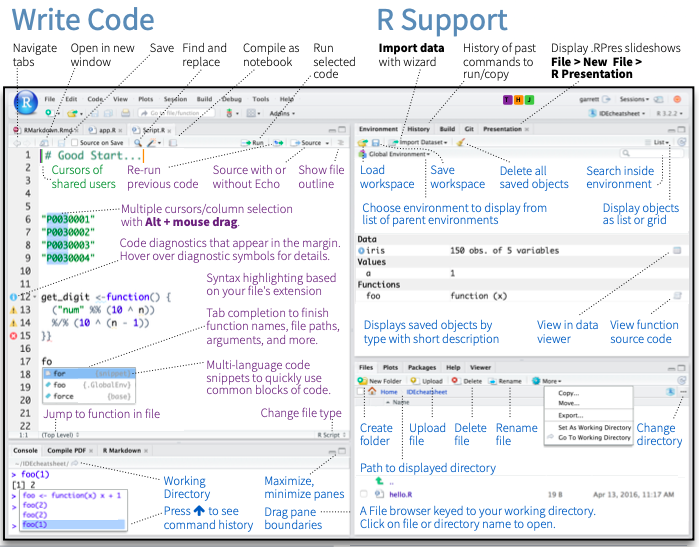

```{r setup, include=FALSE}
knitr::opts_chunk$set(echo = TRUE, cache = 3)
```
# Aula 01: Apresentação da Disciplina, Introdução ao R

## Sobre o que trata-se esta disciplina
De acordo com a Ementa, a disciplina versa sobre estatística não paramétrica; estatística bayesiana; técnicas avançadas de análise multivariada; sistemas de equações estruturais e mineração de dados. 

Nesta disciplina trabalharemos com certa flexibilidade em apenas alguns tópicos considerados relevantes. Nesta lógica, revisaresmo os conceitos de testes de hipóteses, teremos uma breve introdução ao software estatístico R e avançaremos por técnicas de analise de dados que vêm recebendo destaque nas aplicações dentro das organizações.

## Conteúdos
\begin{center}
\begin{tabular}{ccp{10cm}}
  \hline
  Aula & Data & \multicolumn{1}{c}{Conteúdo} \\
  \hline
  \rowcolor{gray!10} & & Análise de dados - Técnicas Tradicionais\\
  \hline
   1 & 06/03 & Apresentação da disciplina, R-Package com RStudio \\
   2 & 13/03 & Conceitos de Testes de hipóteses e aplicações \\
   3 & 20/03 & Modelos Lineares de Regressão e Generalizados \\
   4 & 27/03 & Análise de Cluster - K-means \\
   5 & 03/04 & Análise Fatorial Exploratória - Testes diagnósticos e interpretações\\
  \hline
  \rowcolor{gray!10} & & Big Data \& Analytics\\
  \hline
   6 & 17/04 & Introdução à Data Mining - Association Rules \\
   7 & 24/04 & Modelo de aprendizagem supervisionada: Artificial Neural Networks \\
   8 & 08/05 & Modelo de Classificação: Linear Support Vector Machine \\
   9 & 15/05 & Otimização Combinatória: Simulated Annealing \\
  10 & 22/05 & Otimização Combinatória: Genetic Algorithm \\ 
  \hline
  \rowcolor{gray!10} & & Projeto Aplicado\\
  \hline
  11 & 29/05 & Definição do problema - Planejamento da solução \\
  12 & 05/06 & Implementação da Solução \\
  13 & 19/06 & Implementação da Solução \\
  14 & 26/06 & Validação dos Resultados\\
  15 & 03/07 & Apresentação dos resultados - Entrega do relatório\\
  \hline
\end{tabular}
\end{center}

## Ferramentas

### O que é o R?
Um ambiente que integra diversos programas para computação estatística e composição de gráficos.

* Permite manipulação e armazenamento de dados.
* Oferece um conjunto de operadores para cálculos sobre vetores e matrizes.
* Coloca à disposição do usuário uma grande coleção de ferramentas para análise de dados.
* Comunicação por meio de uma linguagem simples e eficaz, similar à linguagem S.

O R pode ser obtido a partir de algum *mirror* no seu site oficial [*The R Project for Statistical Computing*](http://www.r-project.org)

Se foi feita a instalação completa do R, é muito provável que esteja disponível uma vasta documentação própria do R.

* Perguntas freqüentes do R
* Perguntas freqüentes do R para ambiente Windows
* Manuais em Portable Document Format (PDF)
* Ajuda online via comando help( ).
* Ajuda em HTML (com Introdução, Busca, Pacotes, Linguagem R, Instalação e Administração, etc.)

Um comando importante – fundamental – é o help( ):

* help(FUNCAO)
* help(“ASSUNTO”)

Recentemente, a comunidade desenvolveu o programa [RStudio](http://rstudio.com), que adiciona uma série de funcionalidades visuais ao ambiente de programação, na busca de torná-lo mais amigável. O RStudio é um ambiente de desenvolvimento integrado (IDE) para R. Ele inclui um console, editor de realce de sintaxe que suporta execução direta de código, além de ferramentas para plotagem, histórico, depuração e gerenciamento de espaço de trabalho.

Utilizaremos a opção RStudio Cloud, uma plataforma on-line onde é necessário apenas um navegador e acesso a internet. O RStudio, seja na versão local ou na Cloud, tem a aparência apresentada na Figura 1. Esta imagem foi recortada do RStudio IDE CHEAT SHEET, que você pode baixar no link [https://github.com/rstudio/cheatsheets/raw/master/rstudio-ide.pdf](https://github.com/rstudio/cheatsheets/raw/master/rstudio-ide.pdf).

```{r pressure, echo=FALSE, fig.cap="RStudio IDE CHEAT SHEET", out.width = '100%'}

```

### Tarefa 
1. Acessar o RStudio Cloud no link [http://rstudio.cloud](http://rstudio.cloud).
2. Fazer o cadastro.
3. Criar um projeto para a disciplina no ambiente.
4. Explorar os espaços e utilizar os primeiros comandos.

## Introdução ao *software* e linguagem R
O ideal para aprender a usar o R é "usá-lo!". Então, a melhor forma de se familiarizar com os comandos do R é ler um texto introdutório e ao mesmo tempo ir digitando os comandos no R e observando os resultados, gráficos, etc. Aprender a usar o R pode ser difícil e trabalhoso, mas lembre-se, o investimento será para você!

Para usar o R é necessário conhecer e digitar comandos. Alguns usuários acostumados com outros programas notarão de início a falta de "menus" (opções para clicar). Na medida em que utilizam o programa, os usuários (ou boa parte deles) tendem a preferir o mecanismo de comandos, pois é mais flexível e com mais recursos. Algumas pessoas desenvolveram módulos de “clique-clique” para o R, como o R-commander. Porem, eu acredito que ao usar um módulo de “clique-clique” perdemos a chance de aprender uma das maiores potencialidades e virtudes do R, que é a programação.

O R é case-sensitive, isto é, ele diferencia letras maiúsculas de minúsculas, portanto A é diferente de a. O separador de casas decimais é ponto ".". A vírgula é usada para separar argumentos (informações). Não é recomendado o uso de acentos em palavras (qualquer nome que for salvar em um computador, não só no R, evite usar acentos. Acentos são comandos usados em programação e podem causar erros, por exemplo, em documentos do word e excel).

O R é um programa leve (ocupa pouco espaço e memória) e geralmente roda rápido, até em computadores não muito bons. Isso porque ao instalarmos o R apenas as configurações mínimas para seu funcionamento básico são instaladas (pacotes que vem na instalação “base”). Para realizar tarefas mais complicadas pode ser necessário instalar pacotes adicionais (packages). Não basta apenas instalar um pacote. Para usá-lo é necessário "carregar" o pacote sempre que você abrir o R e for usá-lo. Use a função library para rodar um pacote.

No R existe um comando que mostra como citar o R ou um de seus pacotes. Veja como fazer:
```{r}
citation()
```
Para citar um pacote, por exemplo psych, basta colocar o nome do pacote entre aspas:
```{r}
citation("psych")
```

### R como calculadora
O forma de uso mais básica do R é usá-lo como calculadora. Os operadores matemáticos básicos são: + para soma, - subtração, * multiplicação, / divisão e ^ exponenciação. Digite as seguintes operações na linha de comandos do R:
```{r eval=FALSE}
2+3
2*3
2/3
2^3
```
O R tem diversas funções que podemos usar para fazer os cálculos desejados. O uso básico de uma função é escrever o nome da função e colocar os argumentos entre parênteses, por exemplo: **função(argumentos)**. **função** especifica qual função irá usar e **argumentos** especifica os argumentos que serão avaliados pela função. Não se assuste com esses nomes, com um pouco de pratica eles se tornarão triviais. Rode as seguintes linhas de código no R para comprender melhor o uso de funções:
```{r eval=FALSE}
sqrt(9)       # Extrai a raiz quadrada dos argumentos entre parênteses
sqrt(2*3^2)   # Extrai a raiz quadrada de 18
sqrt((2*3)^2) #Extrai a raiz quadrada de 36
seq(from = 1, to = 5, by = 1 )  # Gera uma sequência de um até 5 em intervalo regular
prod(1,2,3,4) # Determina o produtório 1x2x3x4
```

### Objetos do R (O que são?):

O que são os Objetos do R? Existem muitos tipos de objetos no R que só passamos a conhecê-los bem com o passar do tempo. Por enquanto vamos aprender os tipos básicos de objetos.

1. vetores: uma seqüência de valores numéricos ou de caracteres (letras, palavras).
2. matrizes: coleção de vetores em linhas e colunas, todos os vetores dever ser do mesmo tipo (numérico
ou de caracteres).
3. dataframe: O mesmo que uma matriz, mas aceita vetores de tipos diferentes (numérico e caracteres). Geralmente nós guardamos nossos dados em objetos do tipo data frame, pois sempre temos variáveis numéricas e variáveis categóricas (por exemplo, largura do rio e nome do rio, respectivamente).
4. listas: conjunto de vetores, dataframes ou de matrizes. Não precisam ter o mesmo comprimento, é a forma que a maioria das funções retorna os resultados.
5. funções: as funções criadas para fazer diversos cálculos também são objetos do R. No decorrer da apostila você verá exemplos de cada um destes objetos.

Algumas funções do R possuem demonstrações de uso. Vejamos alguns exemplos:
```{r eval=FALSE}
demo(graphics)
demo(persp)
```

### Como criar objetos?
O comando <- (sinal de menor e sinal de menos) significa assinalar (assign). Indica que tudo que vem após este comando será salvo com o nome que vem antes. Se quisermos atribuir um vetor de dados ao nome **x** para cálculos posteriores, podemos fazê-lo da seguinte forma:
```{r Code Block 1, results='hide'}
x <- c(2,3,4,5,6,9,12,14,16,17,21,24)
```
onde **x** é o nome atribuído ao vetor e **c** a função concatenar que agrupa os dados entre parênteses dentro do objeto que será criado. Para ver os valores (o conteúdo de um objeto), basta digitar o nome do objeto na linha de comandos.
```{r Code Block 2, message=FALSE, warning=FALSE, echo=FALSE}
x
```
Para fazer operações com objetos vetorias, existem funções úteis, como por exemplo algumas funções estatísticas.
```{r Code Block 3, message=FALSE, warning=FALSE}
length(x) # Tamanho do vetor
min(x)    # Mínimo valor de x
max(x)    # Máximo valor de x
mean(x)   # Média aritmética de x
sd(x)     # Desvio-padrão de x
```
Se quiser usar estas informações posteriormente, basta salvá-las em um objeto no ambiente que ele poderá ser chamado a qualquer tempo.
```{r Code Block 4, message=FALSE, warning=FALSE}
sum(x)
media <- mean(x)
n <- length(x)
media
n
media * n
```

### Acessar valores dentro de um objeto [colchetes]

Caso queira acessar apenas um valor do conjunto de dados use colchetes [ ]. Isto é possível porque o R salva os objetos como vetores, ou seja, a sequencia na qual você incluiu os dados é preservada. Por exemplo, vamos acessar o quinto valor do objeto **x**.
```{r Code Block 5, message=FALSE, warning=FALSE}
x[5]
```
ou os valores de ordem 3, 5 e 7...
```{r Code Block 6, message=FALSE, warning=FALSE}
x[c(3,5,7)]
```
Se deseja substituir ou excluir um valor, proceda da seguinta forma:
```{r Code Block 7, message=FALSE, warning=FALSE}
x
x[10] <- 99   # Altera o décimo valor para 99
x
x[-10]        # Note que o décimo valor (99) não aparece
```

### Transformar dados
Em alguns casos é necessário, ou recomendado, que você transforme seus dados antes de fazer suas análises. Transformações comumente utilizadas são log e raiz quadrada.
```{r Code Block 8, message=FALSE, warning=FALSE}
sqrt(x)   # Raiz quadrada dos valores de x
log10(x)  # log(x) na base 10, apenas
log(x)    # logaritmo natural de x
```

Para salvar os dados transformados dê um nome ao resultado. Por exemplo:
```{r Code Block 9, message=FALSE, warning=FALSE}
x.log<-log10(x) # salva um objeto com os valores de aves em log
```

## Gerar dados aleatórios

1. Gerar dados aleatórios com distribuição uniforme

* runif(n, min=0, max=1) gera uma distribuição uniforme com n valores, começando em min e terminando em max.

2. Gerar dados aleatórios com distribuição normal

* rnorm(n, mean=0, sd=1) gera n valores com distribuição normal, com média 0 e desvio padrão 1.

```{r Code Block 10, message=FALSE, warning=FALSE, out.width = '50%', fig.align = "center"}
set.seed(42)      # Fixa semente aleatória para reprodutibilidade
k <- runif(n = 100, min = 2, max = 17)
l <- rnorm(n = 100, mean = 100, sd = 15)
hist(k)           # Histograma dos dados k
hist(l)           # Histograma dos dados l
```

Veja o help da função **?Distributions** para conhecer outras formar de gerar dados aleatórios com diferentes distribuições.

## Selecionar amostras aleatórias, ordenar e atribuir postos (ranks) aos dados

A função sample é utilizada para realizar amostras aleatórias:

**sample(x, size=1, replace = FALSE)** onde x é o conjunto de dados do qual as amostras serão retiradas, size é o número de amostras e replace é onde você indica se a amostra deve ser feita com reposição (TRUE) ou sem reposição (FALSE).
Assim, **sample(1:10,5)** seleciona 5 dados com valores entre 1 e 10.
Como não especificamos o argumento replace o padrão é considerar que a amostra é sem reposição (= FALSE).
Com a função sample nós podemos criar varios processos de amostragem aleatória. Por exemplo, vamos criar uma moeda e "jogá-la" para ver quantas caras e quantas coroas saem em 10 jogadas.
```{r Code Block 11, message=FALSE, warning=FALSE}
moeda<-c("CARA","COROA") # primeiro criamos a moeda
sample(moeda,10,replace=TRUE) 
```

A função sort coloca os valores de um objeto em ordem crescente ou em ordem decrescente. 
```{r Code Block 12, message=FALSE, warning=FALSE}
set.seed(42)
exemplo<-sample(1:100,10)
exemplo
sort(exemplo) # para colocar em ordem crescente
sort(exemplo, decreasing=TRUE) # para colocar em ordem decrescente 
```

A função order retorna a posição original de cada valor do objeto **exemplo** caso os valores do objeto **exemplo** sejam colocados em ordem.
```{r Code Block 13, message=FALSE, warning=FALSE}
order(as.array(exemplo) )
```

Note que o primeiro valor acima é 5, isso indica que se quisermos colocar o objeto **exemplo** em ordem crescente o primeiro valor deverá ser o quinto valor  do **exemplo**, que é o valor 18 (o menor deles). 
```{r Code Block 14, message=FALSE, warning=FALSE}
order(exemplo,decreasing=TRUE)
```

É importante entender o comando order, pois ele é muito usado para colocar uma planilha de dados seguindo a ordem de alguma de suas variáveis. 

A função rank atribui postos aos valores de um objeto.
```{r Code Block 15, message=FALSE, warning=FALSE}
exemplo # apenas para relembrar os valores do exemplo
rank(exemplo) # Para atribuir postos (ranks) aos valores do exemplo
```

Veja que `r max(exemplo)` é o maior valor do exemplo, portanto recebe o maior rank, no caso 10.

## Importar conjunto de dados para o R
A tarefa de importar conjuntos de dados na versão nativa do R sempre foi um tanto desafiadora. Funções e argumentos além da necessidade de instalar e carregar pacotes especificos se os dados não estavam no formato adequado. Com o RStudio, a tarefa ficou muito simplificada pela facilidade de utilizar os menus - algo tipo *Click-and-Play*!

**Crie um arquivo em Excel e explore o ambiente do RStudio. Na aba Environment, utilize a opção Import Dataset. Os pacotes necessários para carregar a sua planilha serão instalados e carregados pelo RStudio. LEMBRE-SE DE COMO DEVE SER CONSTRUÍDA UMA BASE DE DADOS PARA ANÁLISE!!!** 

### Para selecionar (extrair) apenas partes do nosso conjunto de dados usando [ ] colchetes. 
O uso de colchetes funciona assim: [linhas, colunas], onde está escrito linhas você especifica as linhas desejadas, na maioria dos casos cada linha indica uma unidade amostral. Onde está escrito colunas, você pode especificar as colunas (atributos) que deseja selecionar.

Se você ainda não carregou uma matriz de dados para o R, vamos criar uma **data.frame** de dados aleatórios com a função **matrix** e selecionar parte dos dados como exemplo. Na sua planilha carregada funciona da mesma forma.
```{r  Code Block 16, message=FALSE, warning=FALSE}
dados <- as.data.frame(matrix(data = rnorm(n=20, mean = 20, sd = 5), ncol = 5))
dados
dados[1,3] # dado da linha 1 e coluna 3
dados[2,]  # dados da linha 2
dados[,5]  # dados da coluna 5
dados[2:3,2:4] # submatriz com dados das linhas 2 e 3 e colunas 2 a 4
```

Segue outras funções úteis. teste-as e verifique o que acontece. Leia também a ajuda desta funções:

* ls()
* dir()
* getwd()

A sequência da apredizagem do R se dá com uso, leitura de manuais, ajuda e fóruns da internet... Mãos a obra

## Atividades
1. Suponha que você marcou o tempo que leva para chegar a cada uma de suas parcelas no campo. Os tempos em minutos foram: 18, 14, 14, 15, 14, 34, 16, 17, 21, 26. Passe estes valores para o R, chame o objeto de tempo. Usando funções do R ache o tempo máximo, mínimo e o tempo médio que você levou gasta para chegar em suas parcelas.

* Ops, o valor 34 foi um erro, ele na verdade é 15. Sem digitar tudo novamente, e usando colchetes [ ], mude o valor e calcule novamente o tempo médio.

2. Calcule o módulo de $2^3 \times -3^2$

3. Suponha que você coletou 10 amostras em duas reservas, as 5 primeiras amostras foram na reserva A e as 5 ultimas na reserva B. Use a função **rep** para criar um objeto chamado locais que contenha 5 letras A seguidas por cinco letras B.

4. Suponha que você deseje jogar na mega-sena, mas não sabe quais números jogar, use a função **sample** do R para escolher seis números para você. Lembre que a mega-sena tem valores de 1 a 60.

5. Einstein disse que Deus não joga dados, mas o R joga! Simule o resultado de 25 jogadas de um dado. 

6. Crie um objeto com estes dados: 9 0 10 13 15 17 18 17 22 11 15 e chame-o de temp. Agora faça as seguintes transformações com esses dados: 
* raiz quadrada de temp, 
* log natural de temp, 
* log(x+1) de temp, 
* eleve os valores de temp ao quadrado.

7. Crie um objeto chamado info que contem seu nome, idade, altura, peso, email e telefone.