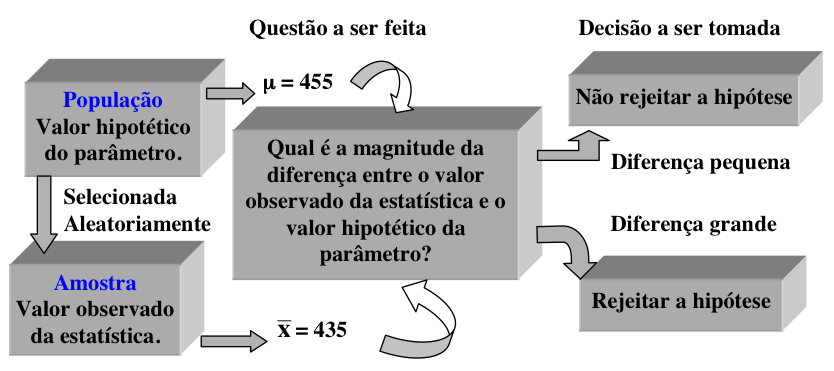

```{r setup, include=FALSE}
knitr::opts_chunk$set(echo = TRUE, cache = 0)
```
# Aula 02: Conceitos de Testes de Hipóteses e Aplicações

## Hipóteses
Em um teste de hipóteses, desejamos testar a hipótese de que, provavelmente, o valor do parâmetro suposto seja verdadeiro (ou não) para a população de onde foi extraída a amostra. 
Em termos gerais, uma hipótese é uma conjectura sobre algum fenômeno ou conjunto de fatos. Em estatística inferencial o termo hipótese tem um significado bastante especifico. É uma conjectura sobre um ou mais parâmetros populacionais. O teste de hipóteses envolve fazer inferências sobre a natureza da população com base nas observações de uma amostra extraída desta população.

Uma hipótese estatística é uma suposição ou afirmação que pode ou não ser verdadeira, relativa a uma ou mais populações. 
A veracidade ou falsidade de uma hipótese estatística nunca é conhecida com certeza, a menos que, se examine toda a população, o que é impraticável na maior parte das situações.
Desta forma, toma-se uma amostra aleatória da população de interesse e com base nesta amostra é estabelecido se a hipótese é provavelmente verdadeira ou provavelmente falsa.

Em estatística trabalha-se com dois tipos de hipótese. A hipótese nula é a hipótese de igualdade. Esta hipótese é denominada de hipótese de nulidade e é representada por $H_{0}$ (lê-se h zero). 
A hipótese nula é normalmente formulada com o objetivo de ser rejeitada. A rejeição da hipótese nula envolve a aceitação de outra hipótese denominada de alternativa ($H_{1}$). 
Esta hipótese é a definição operacional da hipótese de pesquisa que se deseja comprovar. A natureza do estudo vai definir como deve ser formulada a hipótese alternativa. 
Por exemplo, se o parâmetro a ser testado é representado por $\theta$,
então a hipótese nula seria: $H_{0}:\theta=\theta_{0}$ e as hipóteses
alternativas poderiam ser: $H_{1}:\theta\neq\theta_{0}$; $H_{1}:\theta>\theta_{0}$
ou $H_{1}:\theta<\theta_{0}$. 
No primeiro caso, $H_{1}:\theta\neq\theta_{0}$,
diz-se que o teste é bilateral (ou bicaudal), se $H_{1}:\theta>\theta_{0}$,
diz-se que o teste é unilateral (ou unicaudal) à direita e se $H_{1}:\theta<\theta_{0}$,
então, diz-se que o teste é unilateral (ou unicaudal) à esquerda. 

A lógica de um teste de hipóteses pode ser descrita pela Figura 1.
```{r pressure, echo=FALSE, fig.cap="Lógica de um teste de hipóteses", out.width = '80%', fig.align = "center"}

```

# Principais medidas e testes
Para as atividades a seguir, utilizaremos a base de dados XXXX disponível no ambiente virtual de aprendizagem. Carregue a base de dados no R antes de inciar. **Fique atendo ao nome atribuído a base!**
```{r Code Block 0, message=FALSE, warning=FALSE}
library(readxl)
mydata <- read_excel("Seguro_Residencial.xlsx", sheet = "Seguro")
```


## Gerando tabelas de frequências

Você pode gerar tabelas de frequência usando a função **table( )**, tabelas de proporções usando a função **prop.table( )** e frequências marginais usando **margin.table( )**.
```{r Code Block 1}
# 2-Way Frequency Table 
mytable <- table(mydata$Tipo, mydata$Fraudulento) 
# Tipo será linhas, Fraudulento será colunas 
mytable # print table 

margin.table(mytable, 1) # Tipo frequencies (summed over Fraudulento) 
margin.table(mytable, 2) # Fraudulento frequencies (summed over Tipo)

prop.table(mytable) # cell percentages
prop.table(mytable, 1) # row percentages 
prop.table(mytable, 2) # column percentages
```

**table( )** também pode gerar tabelas multidimensionais com base em 3 ou mais variáveis categóricas. Porém, a função **ftable( )**  imprime os resultados de maneira mais atraente.

```{r Code Block 2}
# 3-Way Frequency Table 
mytable <- table(mydata$Tipo, mydata$Fraudulento, mydata$Formação) 
ftable(mytable)
```

**xtabs( )** permite criartabelas de contingência usando estilo de fórmula como *input*.
```{r Code Block 3}
# 3-Way Frequency Table
mytable <- xtabs(~Tipo+Fraudulento+Formação, data=mydata)
ftable(mytable) # print table 
summary(mytable) # chi-square test of indepedence
```

Se uma variável for incluída no lado esquerdo da fórmula, será considerado um vetor de frequências (útil se os dados já tiverem sido tabulados).

## Testes de Independência
### Teste Qui-Quadrado
Para tabelas bidirecionais, você pode usar **chisq.test(mytable)** para testar a independência da variável de linha e coluna. Por padrão, o valor p é calculado a partir da distribuição qui-quadrado assintótica da estatística de teste. Opcionalmente, o valor-p pode ser derivado via simultânea de Monte Carlo.

### Teste exato de Fisher
**fisher.test(x)** fornece um teste exato de independência. **x** é uma tabela de contingência bidimensional em forma de matriz.

### Teste de Mantel-Haenszel
Use a função **mantelhaen.test(x)** para executar um teste qui-quadrado de Cochran-Mantel-Haenszel da hipótese nula de que duas variáveis nominais são condicionalmente independentes em cada estrato, assumindo que não haja interação de três vias. **x** é uma tabela de contingência tridimensional, em que a última dimensão se refere aos estratos.

### Modelos Loglineares
Você pode usar a função **loglm()* no pacote MASS para produzir modelos lineares de log. Por exemplo, vamos supor que temos uma tabela de contingência de três vias com base nas variáveis Tipo, Fraudulento e Formação.

```{r Code Block 4}
require(MASS)
mytable <- xtabs (~ Tipo + Fraudulento + Formação, data=mydata)
```
Podemos realizar teste para verificar a independência mútua: Tipo, Fraudulento e Formação são independentes por pares?
```{r Code Block 5}
loglm (~ Tipo + Fraudulento + Formação, mytable)
```
### Medidas de associação
A função **assocstats(mytable)** no pacote **vcd** calcula o coeficiente phi, coeficiente de contingência e o Cramer's V para uma tabela r x c. A função **kappa(mytable)** no pacote **vcd** calcula Cohen's kappa e weighted kappa para uma matriz de confusão. Veja o artigo de Richard Darlington's [Measures of Association in Crosstab Tables](http://node101.psych.cornell.edu/Darlington/crosstab/TABLE0.HTM) para uma revisão sobre estas estatísticas.

## Testes de normalidade
Uma das premissas para a maioria dos testes paramétricos serem confiáveis é que os dados são distribuídos aproximadamente como uma normal. A distribuição normal atinge o pico no meio e é simétrica em relação à média. Os dados não precisam ser perfeitamente distribuídos normalmente para que os testes sejam confiáveis, mas sua verificação é altamente recomendada para garantir os resultados em termos probabilísticos.

A plotagem de um histograma da variável de interesse fornecerá uma indicação da forma do
distribuição. Uma curva de densidade suaviza o histograma e pode ser adicionada ao gráfico.
Primeiro, produza o histograma para os dados normalmente distribuídos (normal) e adicione uma curva de densidade. Repita para os dados assimétricos (assim).
```{r Code Block 6, message=FALSE, warning=FALSE, out.width = '50%', fig.align = "center"}
set.seed(2019)
normal <- rnorm(50)
assim <- rchisq(50,1)
hist(normal,probability=T, main="Histogram of normal data",
     xlab="Approximately normally distributed data") 
lines(density(normal),col=2)
hist(assim,probability=T, main="Histogram of skewed data",
     xlab="Approximately skewed distributed data") 
lines(density(assim),col=2)
```
É muito improvável que um histograma dos dados da amostra produza uma curva normal perfeitamente suave, especialmente se o tamanho da amostra for pequeno. Desde que os dados sejam distribuídos aproximadamente normalmente, com um pico no meio e bastante simétrico, um teste paramétrico pode ser usado.
O gráfico Q-Q normal é um método gráfico alternativo de avaliar a normalidade com o histograma e é mais fácil de usar quando há amostras pequenas. A dispersão compara os dados com uma distribuição normal perfeita. A dispersão deve ficar o mais próximo possível da linha, sem que nenhum padrão óbvio saia da linha para que os dados sejam considerados normalmente distribuídos. Abaixo estão os mesmos exemplos de dados normalmente distribuídos e inclinados.
Desenhe o gráfico qq dos dados normalmente distribuídos usando pch = 19 para produzir círculos sólidos. Após adicione uma linha em que x = y para ajudar a avaliar a proximidade com a dispersão. Repita para os dados assimétricos.
```{r Code Block 6a, message=FALSE, warning=FALSE, out.width = '50%', fig.align = "center"}
qqnorm (normal, principal = "gráfico QQ de dados normais", pch = 19)
qqline (normal)
qqnorm (assim, principal = "gráfico QQ de dados assimétricos", pch = 19)
qqline (assim)
```
Também existem métodos específicos para testar a normalidade, mas eles devem ser usados em conjunto com um histograma ou um gráfico Q-Q. O teste de Kolmogorov-Smirnov e o teste W de Shapiro-Wilk testam se a distribuição subjacente é normal. Ambos os testes são sensíveis a valores discrepantes e são influenciados pelo tamanho da amostra:

* Para amostras menores, é menos provável que a não normalidade seja detectada, mas o teste de Shapiro-Wilk deve ser preferido, pois geralmente é mais sensível.
* Para amostras maiores (ou seja, mais de cem), os testes de normalidade são excessivamente conservadores e a suposição de normalidade pode ser rejeitada com muita facilidade.
* Qualquer avaliação também deve incluir uma avaliação da normalidade de histogramas ou gráficos Q-Q e estes são mais apropriados para avaliar a normalidade em amostras maiores.
```{r Code Block 6b, message=FALSE, warning=FALSE}
shapiro.test(normal) 
shapiro.test(assim)
```

Existem ainda outras opções de testes de normalidade, como por exemplo a correção de Lilliefors para o teste de Kolmogorov-Smirnov, o Aderson darling test, ou ainda o Cramér-von-Misses test.
```{r Code Block 6c, message=FALSE, warning=FALSE}
# Executa a correção de Lilliefors para o teste de Kolmogorov-Smirnov (similar ao SPSS)
require(nortest)
lillie.test(normal)
# Executa o teste de Anderson-Darling para a hipótese composta de normalidade
ad.test(normal)
# Cramer-Von Mises Test For Normality
cvm.test(normal)
```

## Correlações

Pode-se usar a função **cor( )** para produzir correlações e a função **cov( )** para produzir as covariâncias.

O formato simplificado é **cor(x, use=, method= )** onde **x** é uma matriz com dados quantitativos, **use** especifica como lidar com os dados faltantes (missingata) - As opções são **all.obs** (assume que não existem dados faltantes), **complete.obs** (exclui toda a linha), e **pairwise.complete.obs** (exclui o par).

Infelizmente, nem **cor( )** ou **cov( )** produzem os testes de significância, mas pode-se utilizar a função **cor.test( )** para testar um simples coeficiente de correlação. A função **rcorr( )** no pacote **Hmisc** produz correlações e covariâncias e seus níveis de significância para as correlações de Pearson e de Sperman. Entretanto, o *input* precisa ser uma matriz e o método de exclusão *pairwise* é utilizado.

```{r Code Block 7, message=FALSE, warning=FALSE, eval=FALSE}
# Correlations/covariances among numeric variables in 
# data frame mtcars. Use listwise deletion of missing data. 
cor(mtcars, use="complete.obs", method="kendall") 
cov(mtcars, use="complete.obs")

# Correlations with significance levels
require(Hmisc)
rcorr(x,y, type="pearson") # type can be pearson or spearman

#mtcars is a data frame 
rcorr(as.matrix(mtcars))
```

Utilize a função **corrgram( )** para gerar correlogramas e **pairs( )** ou **splom( )** para criar matrizes de diagramas de dispersão.

## Testes de comparação de grupos paramétricos e não-paramétricos
### Testes paramétricos
A função **t.test( )* produz uma série de testes t. Diferentemente da maior parte dos pacotes estatísticos, o padrão assume variâncias diferentes a aplica a correção dos graus de liberdade de Welsh.

```{r Code Block 8, message=FALSE, warning=FALSE, eval=FALSE}
# independent 2-group t-test
t.test(y~x) # where y is numeric and x is a binary factor

# independent 2-group t-test
t.test(y1,y2) # where y1 and y2 are numeric

# paired t-test
t.test(y1,y2,paired=TRUE) # where y1 & y2 are numeric

# one sample t-test
t.test(y,mu=3) # Ho: mu=3

# anova one-way
aov(y~x) # where y is numeric and x is a factor

# anova one-way
foo <- lm(y~x) # where y is numeric and x is a factor
anova(foo)
```

###Testes não paramétricos

R oferece funções para executar os testes Mann-Whitney U, Wilcoxon Signed Rank, Kruskal Wallis e Friedman.

```{r Code Block 9, message=FALSE, warning=FALSE, eval=FALSE}
# independent 2-group Mann-Whitney U Test 
wilcox.test(y~A) 
# where y is numeric and A is A binary factor

# independent 2-group Mann-Whitney U Test
wilcox.test(y,x) # where y and x are numeric

# dependent 2-group Wilcoxon Signed Rank Test 
wilcox.test(y1,y2,paired=TRUE) # where y1 and y2 are numeric

# Kruskal Wallis Test One Way Anova by Ranks 
kruskal.test(y~A) # where y1 is numeric and A is a factor

# Randomized Block Design - Friedman Test 
friedman.test(y~A|B)
# where y are the data values, A is a grouping factor and B is a blocking factor
```

For the wilcox.test you can use the alternative="less" or alternative="greater" option to specify a one tailed test.

## Visualizando os resultados

Além do histograma, que já utilizamos para observar a normalidade, o R proporciona um conjunto de outros tipo de gráficos: Barplot, Dispersão, Box plots, Pie Chart. Os exemplos abaixo utilizam os dados carregados anteriormente nesta aula. Cole os comandos no console do R para verificar os resultados.
```{r Code Block 10, message=FALSE, warning=FALSE, eval=FALSE}
# Simple Bar Plot 
counts <- table(mtcars$gear)
barplot(counts, main="Car Distribution", xlab="Number of Gears")

# Simple Horizontal Bar Plot with Added Labels 
counts <- table(mtcars$gear)
barplot(counts, main="Car Distribution", horiz=TRUE,
  names.arg=c("3 Gears", "4 Gears", "5 Gears"))

# Grouped Bar Plot
counts <- table(mtcars$vs, mtcars$gear)
barplot(counts, main="Car Distribution by Gears and VS",
  xlab="Number of Gears", col=c("darkblue","red"),
  legend = rownames(counts), beside=TRUE)

# Simple Scatterplot
attach(mtcars)
plot(wt, mpg, main="Scatterplot Example", 
   xlab="Car Weight ", ylab="Miles Per Gallon ", pch=19)
# Add fit lines
abline(lm(mpg~wt), col="red") # regression line (y~x) 
lines(lowess(wt,mpg), col="blue") # lowess line (x,y)

# Basic Scatterplot Matrix
pairs(~mpg+disp+drat+wt,data=mtcars, 
   main="Simple Scatterplot Matrix")

# Boxplot of MPG by Car Cylinders 
boxplot(mpg~cyl,data=mtcars, main="Car Milage Data", 
   xlab="Number of Cylinders", ylab="Miles Per Gallon")

# Simple Pie Chart
slices <- c(10, 12,4, 16, 8)
lbls <- c("US", "UK", "Australia", "Germany", "France")
pie(slices, labels = lbls, main="Pie Chart of Countries")

# Pie Chart with Percentages
slices <- c(10, 12, 4, 16, 8) 
lbls <- c("US", "UK", "Australia", "Germany", "France")
pct <- round(slices/sum(slices)*100)
lbls <- paste(lbls, pct) # add percents to labels 
lbls <- paste(lbls,"%",sep="") # ad % to labels 
pie(slices,labels = lbls, col=rainbow(length(lbls)),
   main="Pie Chart of Countries")
```

## Atividades

1. Considere a base de dados **mtcars** utilizada nesta atividade. Descreva as variáveis categóricas **cyl**, **vs** e **gear** por meio de gráficos de colunas (barplot).
2. Verifique se existe associação significativa entre **cyl** e **gear**. Proceda um teste de hipóteses e apresente um gráfico de colunas das duas variáveis em conjunto.
3. Verifique se o consumo (**mpg**) adere a um modelo de distribuição normal.
4. Considerando os resultados obtidos na questão 3, proceda um teste um teste de hipóteses para verificar se **vs** impacta significativamente em **mpg**. Repita para **gear**.