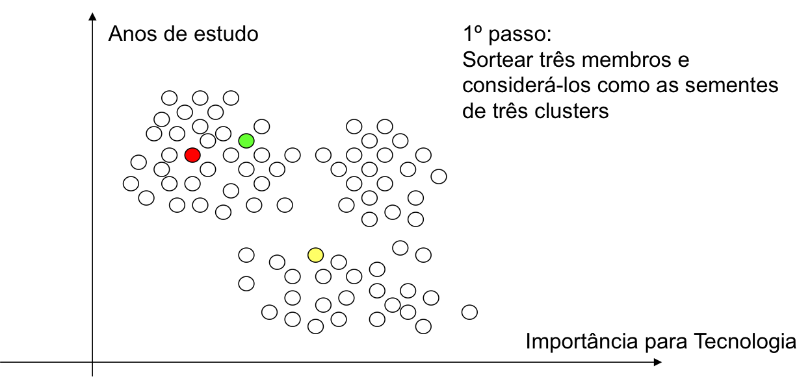
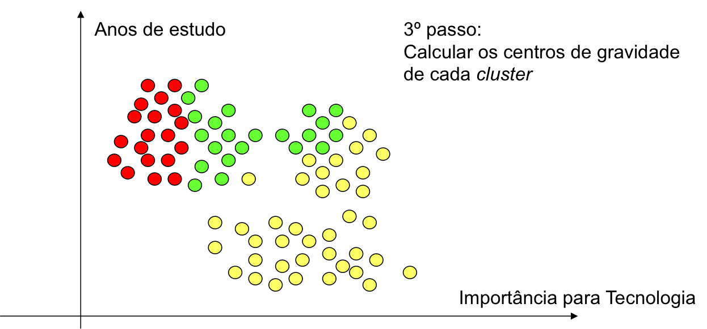
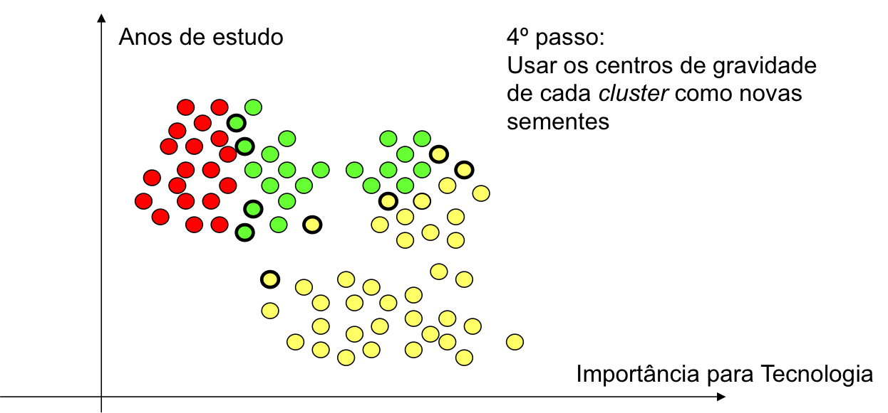
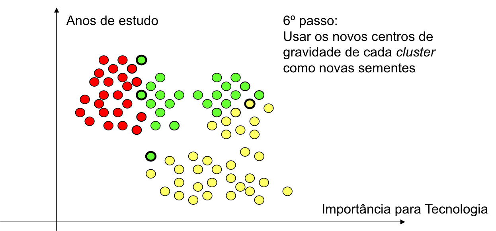
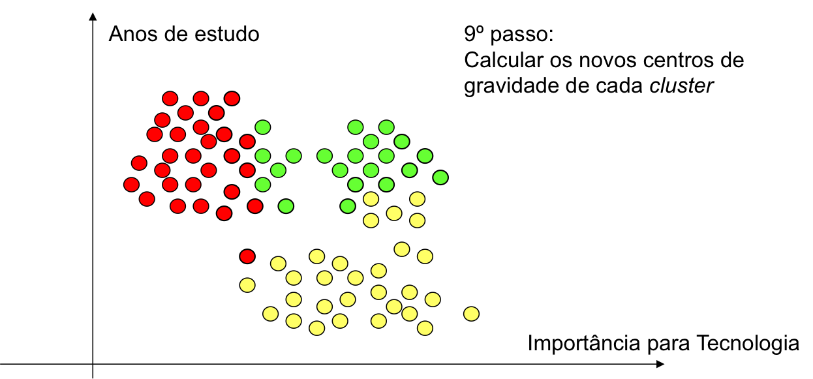
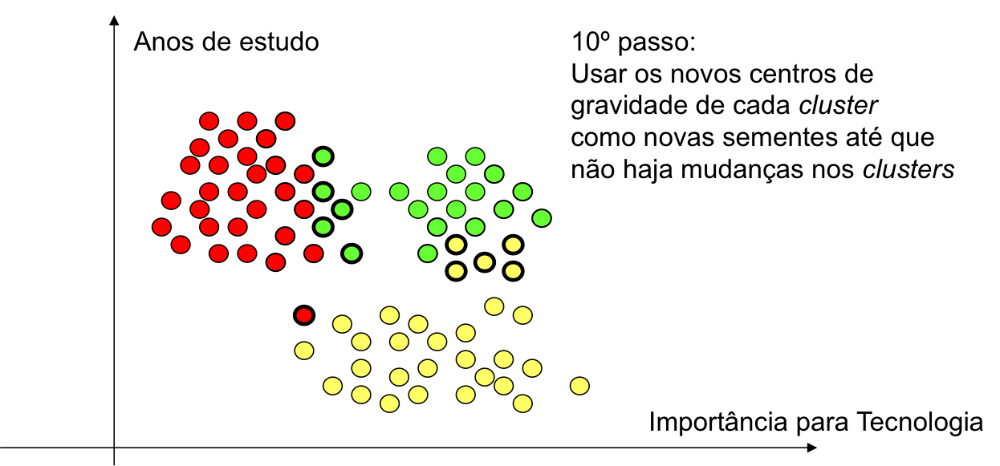
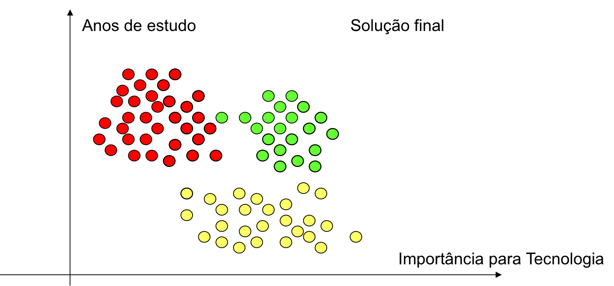

```{r setup, include=FALSE}
knitr::opts_chunk$set(echo = TRUE, cache = 0)
options(tinytex.verbose = TRUE)
```
# Aula 04: Análise de Clusters

**Análise de Clusters** ou *Cluster Analysis* tem por objetivo determinar padrões de variáveis que categorizem grupos, isto é, que identifiquem grupos de indivíduos.

Quanto ao posicionamento, assim como nos modelos de análise fatorial, a análise de clusters prevê no modelo apenas entradas (variáveis independentes) métricas. 

Difere-se da análise discriminante (ou regressão Logística, por ex.) uma vez que nestas, eu sei a qual grupo os elementos da amostra pertencem. 

Na análise de cluster o agrupamento dos elementos da amostra em conglomerados se dá pelas similaridades nas respostas das $k$ variáveis independentes utilizadas na análise.  

A expressão *Cluster analysis* foi utilizada pela primeira vez por Tryon, em 1939.

**Características**

* Detecta grupos homogêneos nos dados
* Grupamento de indivíduos ou objetos em grupos desconhecidos
* Não faz distinção entre variáveis dependentes e independentes

**Observações**

* A análise de aglomerados pode ser caracterizada como uma análise descritiva, não teórica e não inferencial.
* É utilizada principalmente com uma técnica exploratória.


**Suposições**

* Amostra deve ser representativa da população
* Multicolinearidade mínima
  + Devo evitar que duas ou mais variáveis repliquem o mesmo comportamento entre os grupos
  + Analisar correlações (> 0,8 pode representar um multicolinearidade)
* Amostra deve estar livre de *outliers*: Consulta visual via diagrama de perfis ou box-plots
* Razão (núm casos / núm clusters) deve ser razoável

Entre os principais **Critérios de medição da distância** estão:

* Distância Euclidiana: $D(x,y)=\sqrt{\sum_{i=1}^n (x_i-y_i)^2}$
* Distância Euclidiana ao quadrado
* Distância de Manhattan: $D(x,y)=\sum_{i=1}^n |x_i-y_i|$
* entre outras...

O R tem uma vasta variedade de funções para Análise de Clusters. Na aula de hoje nós vamos discutir uma das principais abordagens: Partitioning ou K-menas ou K-médias. O algoritmo k-means é um algoritmo que utiliza o cálculo de kcentróides para o agrupamento dos k clusters. Embora não haja uma solução ótima para o problema de determinar o número de clusters a serem extraídos, uma abordagem promissora é discutida na aula de hoje.

## K-means

O cluster K-means é o método de particionamento mais popular. Requer que o analista especifique o número de clusters a serem extraídos. Uma plotagem da soma dos quadrados dentro dos grupos pelo número de clusters extraídos pode ajudar a determinar o número apropriado de clusters.

Note que a aplicação do método traz algumas exigências como o fato de lidar apenas com variáveis quantitativas (preferêncialmente contínuas), não haver dados faltantes (ver a função **na.omit**) e os dados serem inicialmente padronizados (ver a função **scale**).

A sequencia de imagens a seguir exemplifica o funcionamento do método para onde deseja-se agrupar os respondentes pelo número de anos de estudo e importância para a tecnologia.

{width=50%} {width=50%}
{width=50%} {width=50%}
{width=50%} {width=50%}
{width=50%} {width=50%}
{width=50%} {width=50%}
{width=50%} {width=50%}

Considere inicialmente a base de dados **mtcars**. Vamos isolar as variáveis quantitativas de interesse, excluir os casos com dados faltantes e padronizar as variáveis. Na sequência, vamos construir um gráfico para escolher o número de agrupamentos. 

```{r Code Block 1, message=FALSE, warning=FALSE, out.width = '65%', fig.align = "center"}
require(car)
attach(mtcars)
head(mtcars)
cluster<-na.omit(mtcars)
cluster<-scale(cluster)
.cluster <- cluster[,1:7] # Apenas variáveis quantitativas
# Determine number of clusters
wss <- (nrow(.cluster)-1)*sum(apply(.cluster,2,var))
for (i in 2:15) wss[i] <- sum(kmeans(.cluster, centers=i)$withinss)
plot(1:15, wss, type="b", xlab="Number of Clusters",
ylab="Within groups sum of squares")

```
A análise do gráfico é similar a análise do scree-plot, que veremos mais detalhadamente na aula de Análise fatorial. Por enquanto, basta saber que devemos escolher o ponto de corte que indica o número de clusters quando as inclinações do gráfico tendem a ser iguais a zero.

Uma vez definido o número clusters, o R possui funções para a identfiicação destes. Execute o conjunto de comandos a seguir:
```{r Code Block 2, message=FALSE, warning=FALSE, out.width = '65%', fig.align = "center"}
# K-Means Cluster Analysis
fit <- kmeans(.cluster, 6) # 6 cluster solution
# get cluster means 
aggregate(.cluster,by=list(fit$cluster),FUN=mean)
# append cluster assignment
.cluster <- data.frame(.cluster, fit$cluster)
head(.cluster)
```

Um diagrama de colunas pode mostrar a distribuição dos casos entre os clusters. **Execute um código apropriado para construir um gráfico similar ao apresentado a seguir**.

```{r Code Block 3, message=FALSE, warning=FALSE, echo = FALSE, out.width = '65%', fig.align = "center"}
counts <- table(.cluster$fit.cluster)
barplot(counts, main="Car Distribution", xlab="Cluster")
```

É sempre uma boa idéia analisar visualmente os resultados dos clusters...

```{r Code Block 4, message=FALSE, warning=FALSE, out.width = '65%', fig.align = "center"}
# K-Means Clustering with 6 clusters
fit <- kmeans(cluster, 6)

# Cluster Plot against 1st 2 principal components

# vary parameters for most readable graph
library(cluster) 
clusplot(.cluster, fit$cluster, color=TRUE, shade=TRUE, 
   labels=2, lines=0)

# Centroid Plot against 1st 2 discriminant functions
library(fpc)
plotcluster(.cluster, fit$cluster)
```

## Validando soluções de cluster
A função **cluster.stats()** no pacote **fpc** fornece um mecanismo para comparar a semelhança de duas soluções de cluster usando uma variedade de critérios de validação (coeficiente gama de Hubert, o índice Dunn e o índice rand corrigido) - Faça uma pesquisa rápida pelo Wikipedia (em inglês) para identificar o que são e como são analisados os resultados destes testes ou busque a ajuda do R para referências.

```{r Code Block 5, message=FALSE, warning=FALSE, out.width = '65%', fig.align = "center"}

fit.4 <- kmeans(.cluster, 5)
fit.6 <- kmeans(.cluster, 6)

# comparing 2 cluster solutions
library(fpc)
d <- dist(.cluster)
?cluster.stats
cluster.stats(d, fit.6$cluster, fit.4$cluster)
```
## Atividade

1. Identificar os tipos de testes apresentados pela função **cluster.stats()** e o que significam seus resultados.
