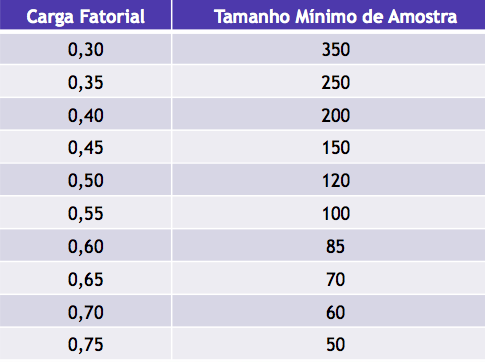

```{r setup, include=FALSE}
knitr::opts_chunk$set(echo = TRUE, cache = 0)
options(tinytex.verbose = TRUE)
```
# Aula 05: Análise Fatorial Exploratória

Quando falamos de análises onde buscamos estabelecer relações de causa e efeito ou que interferem uma no comportamento da outra, consideramos ao menos uma variável independente que tenta explicar o comportamento de uma variável dependente. Em análise multivariada, tem-se um conjunto de variáveis independentes e deseja-se a construção de índices ou indicadores que representem fatores ocultos. Estes fatores chamam-se variáveis latentes e usualmente representam constructos teóricos que norteiam a escolha das variáveis escolhidas.

O objetivo da análise fatorial é o redimensionamento da base de dados de um número $v$ de variáveis mensuráveis para um número $k\: (k<<v)$ de variáveis latentes. Em geral são necessárias grandes amostras para a execução destes procedimentos. A literatura recomenda pelo menos 10 casos por variável mensurada.

O procedimento possui pressupostos básicos que necessitam ser verificados:

* Variáveis correlacionadas $(r>0,30)$;
* Teste de esfericidade de Bartlett significativo (verifica se a matriz de correlações difere de uma matriz identidade);
* Adequação da amostra (KMO > 0,60).

Existem vários métodos de extração de fatores, sendo os mais usuais

* *Principal componentes*: Avalia a variância total;
* *Axis factoring*: Avalia apenas a variância comum através das comunalidades (medida da variância compartilhada das variáveis)

A retenção dos fatores pode ser por diferentes regras: Autovalor > 1, número de fatores pré-definido, percentagem de variância explicada pré-definida e Scree-plot são os mais usuais. A fim de melhorar a interpretação dos fatores, pode-se aplicar uma rotação na solução encontrada:

* Quatimax: cria um super fator inicial
* Varimax: distribui as importâncias dos fatores e concentra as cargas das variáveis
* Equimax: combinação dos anteriores
* Oblíquos: geram rotações sem respeitar a ortogonalidade dos fatores

A cada variável é definido um peso ``de participação'' em cada fator. As variáveis com maiores pesos ditam o significado do fator. Em geral deseja-se cargas fatoriais > 0,4. A tabela apresenta os limites de significância estatística para as cargas fatorias em função do tamanho da amostra com um poder de 80\% e nível de significância de 5\%.
```{r pressure, echo=FALSE, fig.cap="", out.width = '40%', fig.align = "center"}

```

A questão fundamental da análise é 

* Atribuir um nome descritivo aos fatores retidos
* Detectar a essência das variáveis individuais
* Abstrair o objeto de pesquisa

# Componentes Principais

A função **princomp( )** produz uma análise de componentes principais sem rotação. Considere a base de dados *USArrests*.

```{r Code Block 1, message=FALSE, warning=FALSE, out.width = '65%', fig.align = "center"}
# Principal Components Analysis
# entering raw data and extracting PCs 
# from the correlation matrix 
attach(USArrests)
head(USArrests)
mydata <- USArrests
summary(mydata)

fit <- princomp(mydata, cor=TRUE)
summary(fit) # print variance accounted for 
loadings(fit) # pc loadings 
plot(fit,type="lines") # scree plot 
fit$scores # the principal components
biplot(fit, cex=0.65)

```

Use **cor=FALSE** para que as componetes principais sejam extraídas a partir da matriz de covariâncias. Use a opção **covmat=** para entrar com a matriz de correlação ou covariância diretamente. Se entrar com a matriz de covariâncias, a opção **n.obs=** é obrigatória.

A função **principal( )** do pacote **psych** pode ser utilizada para extrair e rotar os fatores pelo método das componentes principais.

```{r Code Block 2, message=FALSE, warning=FALSE, out.width = '65%', fig.align = "center"}
# Varimax Rotated Principal Components
# retaining 5 components 
library(psych)
fit <- principal(mydata, nfactors=4, rotate="varimax")
fit # print results
```

**mydata** pode ser a matriz de dados brutos ou a matriz de covariâncias. Exclusão pareada (*Pairwise deletion*) dos dados faltantes é utilizado e o tipo de rotação pode ser *none*, *varimax*, *quatimax*, *promax*, *oblimin*, *simplimax*, ou *cluster*.

# Análise Fatorial Exploratória

A função **factanal( )** produz a análise fatorial pela função de máxima verossimilhança. Vamos considerar a matriz de correlação de 24 testes psicológicos aplicados em 145 alunos desétima e oitava séries num suburbio de Chicago por Holzinger e Swineford.

```{r Code Block 3, message=FALSE, warning=FALSE, out.width = '65%', fig.align = "center"}
attach(Harman74.cor)
mydata <- Harman74.cor$cov
# Maximum Likelihood Factor Analysis
# entering raw data and extracting 3 factors, 
# with varimax rotation 
fit <- factanal(factors = 3, covmat = Harman74.cor, rotation = "varimax")
print(fit, digits=2, cutoff=.3, sort=TRUE)
# plot factor 1 by factor 2 
load <- fit$loadings[,1:2] 
plot(load, type="n") # set up plot 
text(load[,1], load[,2], labels=rownames(load), cex=0.7) # add variable names
```

A opção **rotation=** inclui as opções *varimax*, *promax*, e *none*. A opção **scores=** *regression* ou *Bartlett* determina como serão produzidos os escores. Use a opção **covmat=** para entrar com a matriz de correlação ou covariância diretamente. Se entrar com a matriz de covariâncias, a opção **n.obs=** é obrigatória.

A função **fa( )** do pacote **psych** ofecere uma série de funções relacioandas a análise fatorial, incluindo *principal axis factoring*.

```{r Code Block 4, message=FALSE, warning=FALSE, out.width = '65%', fig.align = "center"}
# Principal Axis Factor Analysis
library(psych)
fit <- fa(mydata, nfactors=3, rotate="varimax")
fit # print results
```

**mydata** pode ser a matriz de dados brutos ou a matriz de covariâncias. Exclusão pareada (*Pairwise deletion*) dos dados faltantes é utilizado e o tipo de rotação pode ser *varimax* ou *promax*.

## Determinando o número de Fatores para extrair

Uma decisão crucial na análise fatorial exploratória refere-se a quantos fatores eu devo reter. O pacote **nFactors** oferece um conjunto de funções para auxiliar nesta decisão. Vejamos o *Scree plot*.

```{r Code Block 5, message=FALSE, warning=FALSE, out.width = '65%', fig.align = "center"}
# Determine Number of Factors to Extract
library(nFactors)
ev <- eigen(cor(mydata)) # get eigenvalues
ap <- parallel(subject=nrow(mydata),var=ncol(mydata),
  rep=100,cent=.05)
nS <- nScree(x=ev$values, aparallel=ap$eigen$qevpea)
plotnScree(nS)
```

## Testes usuais de adequação da amostra

Os testes mais usuais para a análise fatorial exploratória são o teste de esfericidade de Barttlet, O teste de K-M-O e a medida de consistência interna Alpha de Crombach. Os três procedimentos são apresentados a seguir e estão disponíveis no pacote **psych** do R.

### Bartlett's Test 
O teste de Bartlett verifica que a matriz de correlação não é uma matriz identidade. Uma vez que deseja-se criar variáveis latentes (fatores) a partir da combinação de variáveis que meçam o mesmo constructo, é de se esperar que estas sejam correlacionadas. Caso isto ocorra, a matriz de correlações não será uma matriz identidade (completa de zeros fora da diagonal principal). O teste verifica os residuos da diferença entre a matriz de correlação e uma matriz identidade.

Como entrada deve ser informado a matriz de correlação dos dados e o tamanho da amostra.

```{r Code Block 6, message=FALSE, warning=FALSE, out.width = '65%', fig.align = "center"}
library(psych)
cortest.bartlett(mydata, n = 145, diag=TRUE)
``` 

### Kaiser, Meyer, Olkin Measure Of Sampling Adequacy
Henry Kaiser (1970) introduziu uma Medida de Adequação de Amostragem (MSA) de matrizes de dados analíticos de fatores. Kaiser e Rice (1974) então o modificaram. Isso é apenas uma função dos elementos quadrados da matriz imagem em comparação com os quadrados das correlações originais. O MSA geral e as estimativas para cada item são encontrados. O índice é conhecido como índice Kaiser-Meyer-Olkin (KMO).

Como entrada deve ser informado a matriz de correlação dos dados.

```{r Code Block 7, message=FALSE, warning=FALSE, out.width = '65%', fig.align = "center"}
library(psych)
KMO(mydata)
``` 

### Crombach's Alpha

Alpha é uma das várias estimativas da confiabilidade da consistência interna de um teste. Etenda aqui como teste um questionário ou instrumento de coleta de dados. Como resultado, o teste informa um escore que aponta a consistência interna das respostas obteidas por meio do instrumento de coleta (o teste). Deve-se imputar a base de dados brutos ou a matriz de correlação em conjunto com o tamanho da amostra.

```{r Code Block 8, message=FALSE, warning=FALSE, out.width = '65%', fig.align = "center"}
library(psych)
alpha(mydata, n.obs = 145)
``` 

# Atividade

A base de dados do MAPEM (arquivo salvo no formato do SPSS) foi obtida por meio de um projeto da PETROBRÁS que buscava avaliar o impacto ambiental da perfuração de poços de petróleo em alto mar. As coletas das amostras de solo ocorreram em períodos de tempo, afastadas por uma dada distância em certa direção a partir do ponto onde um poço de petróleo estava sendo perfurado. São observadas variáveis de identfiicação do local de coleta e contagem de animais da macro e micro fauna, composição do solo, químicos e sedimentos. Explore a base de dados para identfiicar os elementos citados. 

1. Faça um esboço da localização dos pontos de coleta a partir das informações da base (tenha como origem do sistema o ponto de perfuração do poço).
2. Verifique a adequação do procedimento de análise fatorial utilizando os três testes apresentados no final deste módulo de estudo.
3. Proceda uma análise fatorial exploratória. Apresente os resultados da análise, identificando o perfil de cada fator retido. Descreva sumariamente os procediemntos e decisões realizados na análise. 
4. Ao final do arquivo, apresente o código utilizado para a realização de toda a análise.