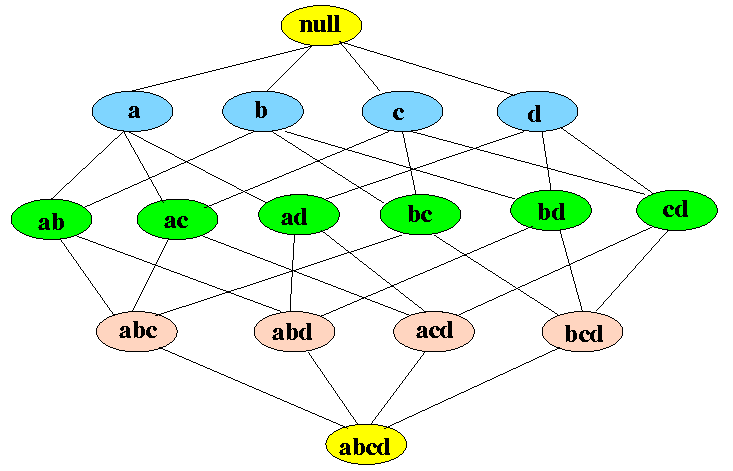
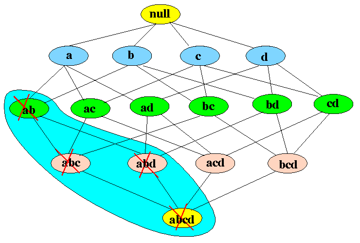

```{r setup, include=FALSE}
knitr::opts_chunk$set(echo = TRUE, cache = 0)
options(tinytex.verbose = TRUE)
```
# Aula 06: Market Basket Analysis using R: An Association Rules application

Nosso objetivo é aprender sobre a análise da cesta de mercado e o algoritmo APRIORI que funciona por trás disso. Você verá como isso está ajudando os varejistas a impulsionar os negócios, prevendo quais itens os clientes compram juntos.

Você é um cientista de dados (ou está se tornando um!) e obtém um cliente que administra uma loja de varejo. Seu cliente fornece dados para todas as transações que consistem em itens comprados na loja por vários clientes durante um período de tempo e solicita que você os utilize para ajudar a impulsionar seus negócios. Seu cliente usará suas descobertas para não apenas alterar/atualizar/adicionar itens no inventário, mas também para alterar o layout da loja física ou melhor, uma loja online. Para encontrar resultados que ajudarão seu cliente, você usará o MBA (Market Basket Analysis), que usa a Mineração de Regras de Associação nos dados de transação fornecidos.

## Association Rule Mining

Association Rule Mining é usado quando você deseja encontrar uma associação entre diferentes objetos em um conjunto, encontrar padrões frequentes em um banco de dados de transações, bancos de dados relacionais ou qualquer outro repositório de informações. As aplicações da Association Rule Mining são encontradas em Marketing, Análise de dados de cesta (ou Análise de cesta de mercado) em varejo, clustering e classificação. Ele pode dizer quais itens os clientes costumam comprar juntos, gerando um conjunto de regras chamado Regras de Associação. Em palavras simples, ele fornece a saída como regras em forma, se é isso ou aquilo. Os clientes podem usar essas regras para diversas estratégias de marketing:

* Alterando o layout da loja de acordo com as tendências
* Análise de comportamento do cliente
* Design do catálogo
* Marketing cruzado em lojas online
* Quais são os itens de tendência que os clientes compram
* E-mails personalizados com vendas adicionais

Considere o seguinte exemplo de transações em um mercado:

1. {pão, leite}
2. {pão, fralda, cerveja, ovos}
3. {leite, fralda, cerveja, cola}
4. {pão, leite, cerveja, fralda}
5. {pão, leite, fralda, cola}

Dado é um conjunto de dados de transação. Você pode ver as transações numeradas de 1 a 5. Cada transação mostra itens comprados nessa transação. Você pode ver que a fralda é comprada com cerveja em três transações. Da mesma forma, o pão é comprado com leite em três transações, tornando-os dois conjuntos de itens frequentes. As regras de associação são fornecidas no formulário abaixo:

$A=>B [Support, Confidence]$

A parte antes de $=>$ é refereido como *if (antecedente)* e a parte depois de $=>$ é referida como *then (consequente)*, onde $A$ e $B$ são conjuntos de itens nos dados de transações. $A$ e $B$ são eventos (conjuntos) disjuntos. Veja o seguinte exemplo:

$Computer => Anti-virus\_Softwares[Support=20\%, confidence=60\%]$

Esta regra diz o seguinte:

1. 20% das transações mostram Anti-vírus software sendo comprado junto com um computador

2. 60% dos compradores que compram Anti-virus Software, o compram junto a uma compra de um computer.

Vamos entender os conceitos básicos de regras de associação.

### Conceitos e definições

1. Itemset: coleção de um ou mais itens. K-item-set significa um conjunto de k itens.

2. Support Count: frequência de ocorrência de um item-set

3. Support (s): frequencia relativa das transações que contém o item-set X

$$ Support(X)=\frac{frequency(X)}{N}$$
Para a regra $A=>B$, Support é dado por: 

$$ Support(A=>B)=\frac{frequency(A,B)}{N}$$

Qual o Support para $leite=>fralda$?

4. Confidence (c): para a regra $A=>B$, confidence mostra a porcentagem em que $B$ é comprado junto com $A$.

$$Confidence(A=>B) = \frac{frequency(A,B)}{frequency(A)}=\frac{P(A \cap B)}{P(A)}$$

O número de transações em $A$ e $B$ dividido pelo número total de transações que contém $A$.

$$Confidence(pão=>leite)=\frac{3}{4}=0,75=75\%$$

Agora encontre a medida Confidence para $leite=>fralda$

Support e confidence medem o quão interessante é a regra. É definido pelo suporte mínimo e pelos limites mínimos de confiança. Esses limites definidos pelo cliente ajudam a comparar a força da regra de acordo com a sua vontade ou a do cliente. Quanto mais próximo do limite, mais a regra é usada pelo cliente.

5. Frequent Itemsets: quando você aplica conjuntos de itens de associação cujo suporte é maior ou igual ao limite (threshold) mínimo de suporte (min_sup). No exemplo acima, min_sup = 3. Isso é definido na escolha do usuário.

6. Strong rules: se a regra $A=>B[Support, confidence]$ satisfaz min_sup e min_confidence, então esta é uma regra forte.

7. Lift: a elevação (lift) fornece a associação entre $A$ e $B$ na regra $A => B$. A associação mostra como um conjunto de itens $A$ afeta o conjunto de itens $B$.

$$Lift(A=>B)=\frac{Support(A=>B)}{Support(A)Support(B)}$$
Por exemplo, para a regra $pão=>leite$, lift é calculado como

$$ support(pão)=\frac{4}{5}=0,8 $$
$$ support(leite)=\frac{4}{5}=0,8 $$
$$ lift(pão=>leite)=\frac{0,6}{0,8 \times 0,8}=0,9 $$

* Se a regra teve um lift de 1, $A$ e $B$ são independentes e nenhuma regra pode ser derivada deles.

* Se o lift for > 1, $A$ e $B$ dependem um do outro, e o grau é dado pelo valor lift.

* Se o lift for < 1, a presença de $A$ terá um efeito negativo em $B$.

**Mas qual o objetivo da Mineração de Regras de Associação?**

Quando você aplica a Mineração de Regras de Associação em um determinado conjunto de transações, seu objetivo é encontrar todas as regras com:

* Suporte maior ou igual a min_support
* Confiança maior ou igual a min_confidence


## APRIORI Algorithm

A Association Rule Mining é vista como uma abordagem em duas etapas:

1. Geração frequente de conjuntos de itens: encontra-se todos os conjuntos de itens frequentes com suporte >= contagem pré-determinada de min_suporte

2. Geração de regras: lista-se todas as regras de associação dos conjuntos de itens frequentes. Calcula-se o Suporte e Confiança para todas as regras e remove-se regras que falham nos limites min_support e min_confidence.

A Geração frequente de itens é a etapa mais cara do ponto de vista computacional, pois requer uma verificação completa do banco de dados.

Entre as etapas acima, a geração de conjunto de itens frequentes é a mais cara em termos de cálculo.

Acima, vimos o exemplo de apenas 5 transações, mas, no mundo real, os dados de transações para varejo podem exceder GB e TBs de dados para os quais é necessário um algoritmo otimizado para remover conjuntos de itens que não ajudarão nas etapas posteriores. Para isso, o algoritmo APRIORI é usado.

\begin{quote}
\Large{\textbf{``Qualquer subconjunto de um itemset frequente também deve ser frequente. Em outras palavras, nenhum superset de um itemset pouco frequente deve ser gerado ou testado''}}
\end{quote}

O algoritmo é representado no Itemset Lattice, que é uma representação gráfica do princípio do algoritmo APRIORI. Ele consiste no nó do conjunto de k itens e na relação de subconjuntos desse conjunto de itens k.

```{r fig1, echo=FALSE, fig.cap="Itemset Lattice", out.width = '50%', fig.align = "center"}

```

Você pode ver na figura acima que na parte inferior estão todos os itens nos dados da transação e, em seguida, você começa a subir criando subconjuntos até o conjunto nulo. Para $d$ número de itens, o tamanho da rede se tornará $2^d$. Isso mostra o quão difícil será gerar o conjunto de itens frequentes, encontrando suporte para cada combinação. A figura a seguir mostra o quanto o APRIORI ajuda a reduzir o número de conjuntos a serem gerados:

```{r fig2, echo=FALSE, fig.cap="Itemset Lattice reduzido", out.width = '50%', fig.align = "center"}

```

Se o conjunto de itens {a, b} não for frequente, não precisamos levar em consideração todos os seus superconjuntos.
Vamos entender isso por um exemplo. No exemplo a seguir, você verá por que o APRIORI é um algoritmo eficaz e também gera regras de associação fortes passo a passo. Pegue o seu caderno e caneta! 

```{r fig3, echo=FALSE, out.width = '85%', fig.align = "center"}
knitr::include_graphics("ASSOCR03.png")
```

Como você pode ver, comece criando a Lista de candidatos para o conjunto de 1 item que incluirá todos os itens presentes nos dados da transação, individualmente. Considerando os dados de transações de varejo do mundo real, você pode ver o quanto essa geração de candidatos é cara. Aqui, o APRIORI desempenha seu papel e ajuda a reduzir o número da lista de candidatos, e regras úteis são geradas no final. Nas etapas a seguir, você verá como chegamos ao final da geração do Conjunto de itens frequentes, que é a primeira etapa da mineração de regras de associação.

```{r fig4, echo=FALSE, out.width = '85%', fig.align = "center"}
knitr::include_graphics("ASSOCR04.png")
```

Seu próximo passo será listar todos os conjuntos de itens frequentes. Você fará o último conjunto de itens frequentes não vazio, que neste exemplo é L2 = {I1, I2}, {I2, I3}. Em seguida, faça todos os subconjuntos não vazios dos conjuntos de itens presentes nessa lista de conjuntos de itens frequentes. Siga como mostrado na ilustração abaixo:

```{r fig5, echo=FALSE, out.width = '65%', fig.align = "center"}
knitr::include_graphics("ASSOCR05.png")
```

Você pode ver acima, existem quatro regras fortes. Por exemplo, considere I2 => I3
ter confiança igual a 75% indica que 75% das pessoas que compraram I2 também compraram I3.
Agora você aprendeu um algoritmo APRIORI completo, que é um dos algoritmos mais usados na mineração de dados. Vamos ao código, phewww!

## Implementando MBA / Mineração de Regras de Associação usando R

Vamos usar um conjunto de dados do UCI Machine Learning Repository. O conjunto de dados é chamado Online-Retail, e você pode baixá-lo [http://archive.ics.uci.edu/ml/index.php](aqui). O conjunto de dados contém dados de transação de 01/12/2010 a 09/12/2011 para um varejo on-line registrado não pertencente a lojas, com sede no Reino Unido. O motivo para usar este e não o conjunto de dados R é que você tem mais chances de receber dados de varejo neste formulário, nos quais terá que aplicar o pré-processamento de dados.

### Descrição do conjunto de dados

* Número de linhas: 541909

* Número de atributos: 08

Informações sobre atributos

* InvoiceNo: número da fatura. Nominal, um número integral de 6 dígitos atribuído exclusivamente a cada transação. Se este código começar com a letra 'c', indica um cancelamento. 

* StockCode: código do produto (item). Nominal, um número integral de 5 dígitos atribuído exclusivamente a cada produto distinto.

* Descrição: nome do produto (item). Nominal.

* Quantidade: as quantidades de cada produto (item) por transação. Numérico.

* InvoiceDate: Data e hora da fatura. Numérico, o dia e a hora em que cada transação foi gerada. Exemplo do conjunto de dados: 1/12/2010 8:26

* Preço unitário: preço unitário. Numérico, preço do produto por unidade em libras esterlinas.

* Identificação do cliente: número do cliente. Nominal, um número integral de 5 dígitos atribuído exclusivamente a cada cliente.

* País: nome do país. Nominal, o nome do país em que cada cliente reside.

### Carregando bibliotecas

Primeiro, você carregará as bibliotecas necessárias.


```{r Code Block 1, message=FALSE, warning=FALSE}
#install and load package arules
if (!require(arules)) install.packages('arules')
#install and load arulesViz
if (!require(arulesViz)) install.packages('arulesViz')
#install and load tidyverse
if (!require(tidyverse)) install.packages('tidyverse')
#install and load readxml
if (!require(readxl)) install.packages('readxl')
#install and load knitr
if (!require(knitr)) install.packages('knitr')
#load ggplot2 as it comes in tidyverse
if (!require(ggplot2)) install.packages('ggplot2')
#install and load lubridate
if (!require(lubridate)) install.packages('lubridate')
#install and load plyr
if (!require(plyr)) install.packages('plyr')
if (!require(dplyr)) install.packages('dplyr')
```

Data Pre-processing

Use a função **read_excel(path to file)** para ler a base de dados em Excel no R.

```{r Code Block 2, message=FALSE, warning=FALSE}
#read excel into R dataframe
retail <- read_excel('Online_Retail.xlsx')
#complete.cases(data) will return a logical vector indicating which rows have no missing
# values. Then use the vector to get only rows that are complete using retail[,].
retail <- retail[complete.cases(retail), ]
#mutate function is from dplyr package. It is used to edit or add new columns to
# dataframe. Here Description column is being converted to factor column. as.factor
# converts column to factor column. %>% is an operator with which you may pipe values
# to another function or expression
retail %>% mutate(Description = as.factor(Description))

retail %>% mutate(Country = as.factor(Country))

#Converts character data to date. Store InvoiceDate as date in new variable
retail$Date <- as.Date(retail$InvoiceDate)
#Extract time from InvoiceDate and store in another variable
TransTime<- format(retail$InvoiceDate,"%H:%M:%S")
#Convert and edit InvoiceNo into numeric
InvoiceNo <- as.numeric(as.character(retail$InvoiceNo))
```
```{r Code Block 2a, message=FALSE, warning=FALSE, eval=FALSE}
#Bind new columns TransTime and InvoiceNo into dataframe retail
cbind(retail,TransTime)

cbind(retail,InvoiceNo)
```
```{r Code Block 2b, message=FALSE, warning=FALSE}
#get a glimpse of your data
glimpse(retail)
```

Agora, a dataframe de varejo contem 10 atributos, com dois atributos adicionais: Data e Hora.

Antes de aplicar a mineração de regra de associação/MBA, precisamos converter o quadro de dados em dados de transação para que todos os itens comprados juntos em uma fatura estejam em uma linha. Você pode ver no **glimpse** que cada transação está na forma atômica, ou seja, todos os produtos pertencentes a uma fatura são atômicos, como nos bancos de dados relacionais. Esse formato também é chamado como formato *singles*.

O que você precisa fazer é agrupar dados no dataframe de varejo por CustomerID, CustomerID e Date ou também pode agrupar dados usando InvoiceNo e Date. Para executar esse agrupamento, aplicamos uma função e armazenamos a saída em outro dataframe. Isso pode ser feito por **ddply**.

As seguintes linhas de código combinam todos os produtos de um InvoiceNo e date e combinam todos os produtos desse InvoiceNo e date como uma linha, com cada item, separado por ",".

```{r Code Block 3, message=FALSE, warning=FALSE}
transactionData <- ddply(retail,c("InvoiceNo","Date"),
                       function(df1)paste(df1$Description,
                       collapse = ","))
#The R function paste() concatenates vectors to character and separated results using
# collapse=[any optional charcater string ]. Here ',' is used
# head(transactionData)
```

Em seguida, como InvoiceNo e Date não serão úteis na mineração de regras, você pode defini-las como NULL.

```{r Code Block 4, message=FALSE, warning=FALSE}
#set column InvoiceNo of dataframe transactionData  
transactionData$InvoiceNo <- NULL
#set column Date of dataframe transactionData
transactionData$Date <- NULL
#Rename column to items
colnames(transactionData) <- c("items")
#Show Dataframe transactionData
#transactionData
```

Esse formato para dados de transação é chamado de formato de cesta. Em seguida, você deve armazenar esses dados da transação em um arquivo .csv (valores separados por vírgula). Para isso, **write.csv()**
```{r Code Block 5, message=FALSE, warning=FALSE}
write.csv(transactionData,"market_basket_transactions.csv", quote = FALSE, row.names = FALSE)
```

Em seguida, você deve carregar esses dados da transação em um objeto da classe de transação. Isso é feito usando a função **read.transactions** do pacote arules no R.
```{r Code Block 6, message=FALSE, warning=FALSE}
tr <- read.transactions('market_basket_transactions.csv', format = 'basket', sep=',')
```


Quando você executa as linhas de código acima, pode obter muito EOF dentro da string citada em sua saída, não se preocupe. Verifique então os dados de transação.
```{r Code Block 7, message=FALSE, warning=FALSE}
tr
summary(tr)
```

O **summary(tr)** é um comando muito útil que nos fornece informações sobre nosso objeto de transação. Vamos dar uma olhada no que a saída acima diz:

* Existem 22191 transações (linhas) e 7876 itens (colunas). Observe que 7876 é a descrição do produto envolvida no conjunto de dados e as transações 22191 são coleções desses itens.

* Densidade informa a porcentagem de células diferentes de zero em uma matriz esparsa. Você pode calcular como o número total de itens comprados dividido por um número possível de itens nessa matriz. Você pode calcular quantos itens foram comprados usando a densidade: 22191x7876x0.001930725 = 337445

Nota: Uma matriz esparsa ou vetor esparso é uma matriz na qual a maioria dos elementos é zero. Por outro lado, se a maioria dos elementos for diferente de zero, a matriz será considerada densa. O número de elementos com valor zero dividido pelo número total de elementos é chamado de esparsidade da matriz (que é igual a 1 menos a densidade da matriz).

* summary também pode informar os itens mais frequentes.

* Distribuição do comprimento do elemento (conjunto de itens/transação): indica quantas transações existem para 1 conjunto de itens, 2 conjuntos de itens e assim por diante. A primeira linha indica um número de itens e a segunda linha indica o número de transações.
Por exemplo, há apenas 3598 transações para um item, 1594 transações para 2 itens e 419 itens em uma transação que é a mais longa.
Você pode gerar um itemFrequencyPlot para criar um item Gráfico de barras de frequência para visualizar a distribuição de objetos com base no **itemMatrix** (por exemplo, >transações ou itens em >itemsets e >rules), que é o nosso caso.

```{r Code Block 8, message=FALSE, warning=FALSE, out.width = '65%', fig.align = "center"}
# Create an item frequency plot for the top 20 items
if (!require("RColorBrewer")) {
  # install color package of R
install.packages("RColorBrewer")
#include library RColorBrewer
library(RColorBrewer)
}
itemFrequencyPlot(tr,topN=20,type="absolute",col=brewer.pal(8,'Pastel2'), 
                  main="Absolute Item Frequency Plot")
```

No **itemFrequencyPlot(tr, topN = 20, tipo = "absoluto")**, o primeiro argumento é o objeto de transação a ser plotado que é tr. topN permite plotar N itens de frequência mais alta. type pode ser type = "absoluto" ou type = "relativo". Se absoluto, plotará as frequências numéricas de cada item independentemente. Se relativo, ele plotará quantas vezes esses itens apareceram em comparação com outros.

Esse gráfico mostra que 'T-LIGHT HEART WHITE HANGING HEART' e 'REGENCY CAKESTAND 3 TIER' têm mais vendas. Portanto, para aumentar a venda de 'SET OF 3 CAKE TINS PANTRY DESIGN', o revendedor pode colocá-lo perto de 'REGENCY CAKESTAND 3 TIER'.

O próximo passo é analisar as regras usando o algoritmo APRIORI. A função **apriori()** está no pacote arules.
```{r Code Block 9, message=FALSE, warning=FALSE}
# Min Support as 0.001, confidence as 0.8.
association.rules <- apriori(tr, parameter = list(supp=0.001, conf=0.8,maxlen=10))
```

A função **apriori** tomará tr como o objeto de transação no qual a mineração será aplicada. O parâmetro permitirá que você defina min_sup e min_confidence. Os valores padrão para o parâmetro são suporte mínimo de 0,1, confiança mínima de 0,8 e máximo de 10 itens (maxlen).

**summary(association.rules)** mostra o seguinte:

* Especificação de parâmetro: min_sup = 0.001 e min_confidence = 0.8 valores com 10 itens como o máximo de itens em uma regra.

* Número total de regras: o conjunto de 49122 regras

* Distribuição do tamanho da regra: Um tamanho de 5 itens tem mais regras: 16424 e o tamanho de 2 itens tem o menor número de regras: 105

* Resumo das medidas de qualidade: valores mínimo e máximo de Suporte, Confiança e Elevação.

* Informações usadas para criar regras: os dados, suporte e confiança que fornecemos ao algoritmo.

Como existem 49122 regras, vamos imprimir apenas as 10 principais:
```{r Code Block 10, message=FALSE, warning=FALSE}
inspect(association.rules [1:10])
```

Usando a saída acima, você pode fazer análises como:

* 100% dos clientes que compraram 'WOBBLY CHICKEN' também compraram 'METAL'.
* 100% dos clientes que compraram 'BLACK TEA' também compraram 'AÇÚCAR' JARS '.

**Limitar o número e tamanho das regras**

Como você pode limitar o tamanho e o número de regras geradas? Você pode fazer isso definindo parâmetros em apriori. Você define esses parâmetros para ajustar o número de regras que receberá. Se você deseja regras mais fortes, pode aumentar o valor de conf e, para regras mais estendidas, dar maior valor ao maxlen.

```{r Code Block 11, message=FALSE, warning=FALSE}
shorter.association.rules <- apriori(tr, parameter = list(supp=0.001, conf=0.8,maxlen=3))
```

Você pode remover regras redundantes que são subsets de regras maiores usando o seguinte comando:

```{r Code Block 12, message=FALSE, warning=FALSE}
subset.rules <- which(colSums(is.subset(association.rules, association.rules)) > 1) 
# get subset rules in vector
length(subset.rules)  #> 3913
subset.association.rules. <- association.rules[-subset.rules] 
# remove subset rules.
```

* **which()** retorna a posição dos elementos no vetor cujo valor é TRUE.

* **colSums()** forma uma soma de linhas e colunas para quadros de dados e matrizes numéricas.

* **is.subset()** Determina se os elementos de um vetor contêm todos os elementos de outro vetor

**Buscando regras de determinados elementos**

Às vezes, você deseja trabalhar em um produto específico. Se você deseja descobrir o que causa influência na compra do item X, pode usar a opção de appearance no comando **apriori**. appearance nos dá opções para definir LHS (IF part) e RHS (then part) da regra.
Por exemplo, para descobrir o que os clientes compram antes de comprar 'METAL', execute a seguinte linha de código:

```{r Code Block 13, message=FALSE, warning=FALSE}
metal.association.rules <- apriori(tr, parameter = list(supp=0.001, conf=0.8),
                                   appearance = list(default="lhs",rhs="METAL"))
# Here lhs=METAL because you want to find out the probability of that in how many
# customers buy METAL along with other items
inspect(head(metal.association.rules))
```

Da mesma forma, para encontrar a resposta para a pergunta Os clientes que compraram METAL também compraram .... você manterá o METAL em lhs:

```{r Code Block 14, message=FALSE, warning=FALSE}
metal.association.rules <- apriori(tr, parameter = list(supp=0.001, conf=0.8),
                                   appearance = list(lhs="METAL",default="rhs"))
inspect(head(metal.association.rules))
```

## Visualizando Regras de Associação

Como haverá centenas ou milhares de regras geradas com base em dados, você precisará de duas maneiras de apresentar suas descobertas. O **ItemFrequencyPlot** já foi discutido acima, o que também é uma ótima maneira de obter os itens mais vendidos.

As seguintes visualizações serão discutidas:

* Gráfico de dispersão

* Gráfico de dispersão interativo

* Representação de regra individual

**Gráfico de dispersão**

Uma visualização direta das regras de associação é usar um gráfico de dispersão usando **plot()** do pacote arulesViz. Ele usa Suporte e Confiança nos eixos. Além disso, a terceira medida de elevação é usada por padrão para colorir (níveis de cinza) dos pontos.

```{r Code Block 15, message=FALSE, warning=FALSE, out.width = '65%', fig.align = "center"}
# Filter rules with confidence greater than 0.4 or 40%
subRules<-association.rules[quality(association.rules)$confidence>0.4]
#Plot SubRules
plot(subRules)
```

O gráfico acima mostra que regras com alta elevação têm baixo suporte. Você pode usar as seguintes opções para a plotagem:

**plot(rulesObject, measure, shading, method)**

* rulesObject: o objeto de regras a ser plotado

* measure: medidas para o interesse das regras. Pode ser Suporte, Confiança, lift ou combinação destes dependendo do valor do método.

* shading: Medida usada para colorir pontos (suporte, confiança, lift). O padrão é elevador.

* method: método de visualização a ser usado (scatterplot, two-key plot, matrix3D).

```{r Code Block 16, message=FALSE, warning=FALSE, out.width = '65%', fig.align = "center"}
plot(subRules, method="two-key plot")
```

O two-key plot usa suporte e confiança nos eixos x e y, respectivamente. Ele usa ordem para colorir. Ordem é o número de itens na regra.

**Gráfico interativo de dispersão**

Um plot interativo incrível pode ser usado para apresentar suas regras que usam arulesViz e plotly. Você pode passar o mouse sobre cada regra e visualizar todas as medidas de qualidade (suporte, confiança e lift).

```{r Code Block 17, message=FALSE, warning=FALSE, out.width = '65%', fig.align = "center"}
plotly_arules(subRules)
```

**Visualizações baseadas em gráficos**

Técnicas baseadas em gráficos visualizam regras de associação usando vértices e arestas, onde os vértices são rotulados com nomes de itens e conjuntos ou regras de itens são representados como um segundo conjunto de vértices. Os itens são conectados aos conjuntos / regras de itens usando setas direcionadas. As setas apontando dos itens para os vértices da regra indicam itens do LHS e uma seta de uma regra para um item indica o RHS. O tamanho e a cor dos vértices geralmente representam medidas de interesse.
Os gráficos são uma ótima maneira de visualizar regras, mas tendem a ficar congestionados à medida que o número de regras aumenta. Portanto, é melhor visualizar menos número de regras com visualizações baseadas em gráficos.
Vamos selecionar 10 regras das sub-regras com a maior confiança e depois plotar um gráfico interativo.

```{r Code Block 18, message=FALSE, warning=FALSE, out.width = '65%', fig.align = "center"}
top10subRules <- head(subRules, n = 10, by = "confidence")
plot(top10subRules, method = "graph",  engine = "htmlwidget")
```

Nota: Você pode tornar todos os seus gráficos interativos usando o parâmetro engine = htmlwidget no gráfico.

**Representação de regras individuais**

Essa representação também é chamada como gráfico de coordenadas paralelas. É útil visualizar quais produtos e quais itens causam que tipo de vendas.
Como mencionado acima, o RHS é o consequente ou o item que propomos que o cliente comprará; as posições estão no LHS, onde 2 é a adição mais recente à nossa cesta e 1 é o item que tínhamos anteriormente.

```{r Code Block 19, message=FALSE, warning=FALSE, out.width = '65%', fig.align = "center"}
# Filter top 20 rules with highest lift
subRules2<-head(subRules, n=20, by="lift")
plot(subRules2, method="paracoord")
```

Olhe para a seta mais acima. Isso mostra que, quando tenho 'CHILDS GARDEN SPADE PINK' e 'CHILDS GARDEN RAKE PINK' em meu carrinho de compras, provavelmente comprarei 'CHILDS GARDEN RAKE BLUE' junto com elas também.

## Conclusões

Parabéns! Executamos o APRIORI, um dos algoritmos mais frequentemente usados na mineração de dados. Aprendemos o necessário sobre a Association Rule Mining, seus aplicativos e seus aplicativos no varejo, chamados de Market Basket Analysis. Agora você também é capaz de implementar a Análise de cesta de mercado em R e apresentar suas regras de associação com ótimos gráficos!

