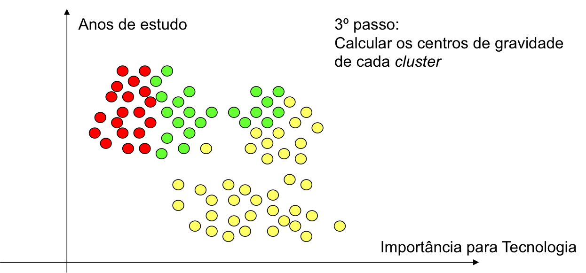
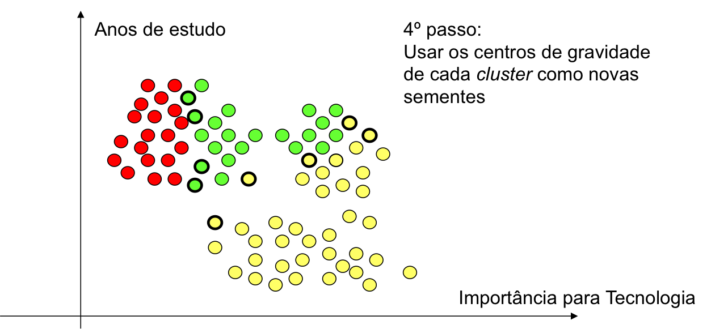
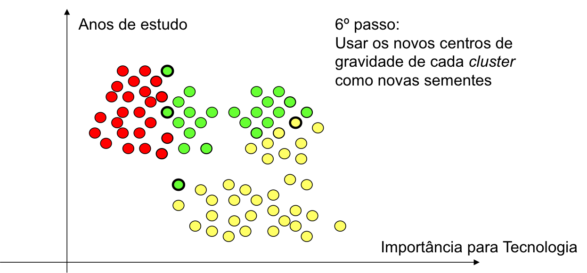
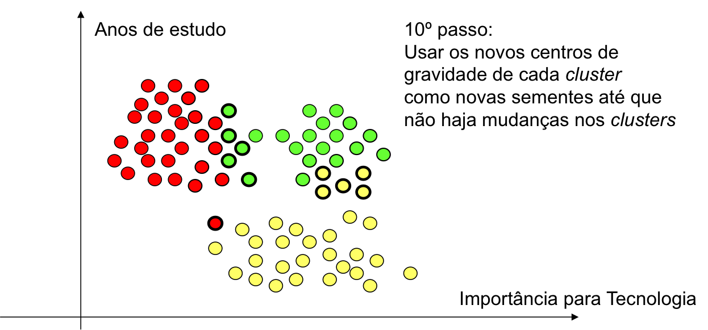
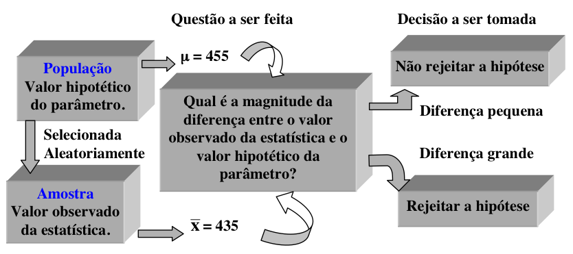

```{r setup, include=FALSE}
knitr::opts_chunk$set(echo = TRUE, cache = 2)
options(tinytex.verbose = TRUE)
```


# Introdução ao R

## O que é o R?
Um ambiente que integra diversos programas para computação estatística e composição de gráficos.

* Permite manipulação e armazenamento de dados.
* Oferece um conjunto de operadores para cálculos sobre vetores e matrizes.
* Coloca à disposição do usuário uma grande coleção de ferramentas para análise de dados.
* Comunicação por meio de uma linguagem simples e eficaz, similar à linguagem S.

O R pode ser obtido a partir de algum *mirror* no seu site oficial [*The R Project for Statistical Computing*](http://www.r-project.org)

Se foi feita a instalação completa do R, é muito provável que esteja disponível uma vasta documentação própria do R.

* Perguntas freqüentes do R
* Perguntas freqüentes do R para ambiente Windows
* Manuais em Portable Document Format (PDF)
* Ajuda online via comando help( ).
* Ajuda em HTML (com Introdução, Busca, Pacotes, Linguagem R, Instalação e Administração, etc.)

Um comando importante – fundamental – é o help( ):

* help(FUNCAO)
* help(“ASSUNTO”)

Recentemente, a comunidade desenvolveu o programa [RStudio](http://rstudio.com), que adiciona uma série de funcionalidades visuais ao ambiente de programação, na busca de torná-lo mais amigável. O RStudio é um ambiente de desenvolvimento integrado (IDE) para R. Ele inclui um console, editor de realce de sintaxe que suporta execução direta de código, além de ferramentas para plotagem, histórico, depuração e gerenciamento de espaço de trabalho.

Utilizaremos a opção RStudio Cloud, uma plataforma on-line onde é necessário apenas um navegador e acesso a internet. O RStudio, seja na versão local ou na Cloud, tem a aparência apresentada na Figura 1. Esta imagem foi recortada do RStudio IDE CHEAT SHEET, que você pode baixar no link [https://github.com/rstudio/cheatsheets/raw/master/rstudio-ide.pdf](https://github.com/rstudio/cheatsheets/raw/master/rstudio-ide.pdf).

```{r, echo=FALSE, fig.cap="RStudio IDE CHEAT SHEET", out.width = '100%'}
knitr::include_graphics("A01-RStudio.png")
```

### Tarefa 
1. Acessar o RStudio Cloud no link [http://rstudio.cloud](http://rstudio.cloud).
2. Fazer o cadastro.
3. Criar um projeto para a disciplina no ambiente.
4. Explorar os espaços e utilizar os primeiros comandos.

## Introdução ao *software* e linguagem R
O ideal para aprender a usar o R é "usá-lo!". Então, a melhor forma de se familiarizar com os comandos do R é ler um texto introdutório e ao mesmo tempo ir digitando os comandos no R e observando os resultados, gráficos, etc. Aprender a usar o R pode ser difícil e trabalhoso, mas lembre-se, o investimento será para você!

Para usar o R é necessário conhecer e digitar comandos. Alguns usuários acostumados com outros programas notarão de início a falta de "menus" (opções para clicar). Na medida em que utilizam o programa, os usuários (ou boa parte deles) tendem a preferir o mecanismo de comandos, pois é mais flexível e com mais recursos. Algumas pessoas desenvolveram módulos de “clique-clique” para o R, como o R-commander. Porem, eu acredito que ao usar um módulo de “clique-clique” perdemos a chance de aprender uma das maiores potencialidades e virtudes do R, que é a programação.

O R é case-sensitive, isto é, ele diferencia letras maiúsculas de minúsculas, portanto A é diferente de a. O separador de casas decimais é ponto ".". A vírgula é usada para separar argumentos (informações). Não é recomendado o uso de acentos em palavras (qualquer nome que for salvar em um computador, não só no R, evite usar acentos. Acentos são comandos usados em programação e podem causar erros, por exemplo, em documentos do word e excel).

O R é um programa leve (ocupa pouco espaço e memória) e geralmente roda rápido, até em computadores não muito bons. Isso porque ao instalarmos o R apenas as configurações mínimas para seu funcionamento básico são instaladas (pacotes que vem na instalação “base”). Para realizar tarefas mais complicadas pode ser necessário instalar pacotes adicionais (packages). Não basta apenas instalar um pacote. Para usá-lo é necessário "carregar" o pacote sempre que você abrir o R e for usá-lo. Use a função library para rodar um pacote.

No R existe um comando que mostra como citar o R ou um de seus pacotes. Veja como fazer:
```{r}
citation()
```
Para citar um pacote, por exemplo psych, basta colocar o nome do pacote entre aspas:
```{r}
citation("psych")
```

### R como calculadora
O forma de uso mais básica do R é usá-lo como calculadora. Os operadores matemáticos básicos são: + para soma, - subtração, * multiplicação, / divisão e ^ exponenciação. Digite as seguintes operações na linha de comandos do R:
```{r eval=FALSE}
2+3
2*3
2/3
2^3
```
O R tem diversas funções que podemos usar para fazer os cálculos desejados. O uso básico de uma função é escrever o nome da função e colocar os argumentos entre parênteses, por exemplo: **função(argumentos)**. **função** especifica qual função irá usar e **argumentos** especifica os argumentos que serão avaliados pela função. Não se assuste com esses nomes, com um pouco de pratica eles se tornarão triviais. Rode as seguintes linhas de código no R para comprender melhor o uso de funções:
```{r eval=FALSE}
sqrt(9)       # Extrai a raiz quadrada dos argumentos entre parênteses
sqrt(2*3^2)   # Extrai a raiz quadrada de 18
sqrt((2*3)^2) #Extrai a raiz quadrada de 36
seq(from = 1, to = 5, by = 1 )  # Gera uma sequência de um até 5 em intervalo regular
prod(1,2,3,4) # Determina o produtório 1x2x3x4
```

### Objetos do R (O que são?):

O que são os Objetos do R? Existem muitos tipos de objetos no R que só passamos a conhecê-los bem com o passar do tempo. Por enquanto vamos aprender os tipos básicos de objetos.

1. vetores: uma seqüência de valores numéricos ou de caracteres (letras, palavras).
2. matrizes: coleção de vetores em linhas e colunas, todos os vetores dever ser do mesmo tipo (numérico
ou de caracteres).
3. dataframe: O mesmo que uma matriz, mas aceita vetores de tipos diferentes (numérico e caracteres). Geralmente nós guardamos nossos dados em objetos do tipo data frame, pois sempre temos variáveis numéricas e variáveis categóricas (por exemplo, largura do rio e nome do rio, respectivamente).
4. listas: conjunto de vetores, dataframes ou de matrizes. Não precisam ter o mesmo comprimento, é a forma que a maioria das funções retorna os resultados.
5. funções: as funções criadas para fazer diversos cálculos também são objetos do R. No decorrer da apostila você verá exemplos de cada um destes objetos.

Algumas funções do R possuem demonstrações de uso. Vejamos alguns exemplos:
```{r eval=FALSE}
demo(graphics)
demo(persp)
```

### Como criar objetos?
O comando <- (sinal de menor e sinal de menos) significa assinalar (assign). Indica que tudo que vem após este comando será salvo com o nome que vem antes. Se quisermos atribuir um vetor de dados ao nome **x** para cálculos posteriores, podemos fazê-lo da seguinte forma:
```{r Code Block 1, results='hide'}
x <- c(2,3,4,5,6,9,12,14,16,17,21,24)
```
onde **x** é o nome atribuído ao vetor e **c** a função concatenar que agrupa os dados entre parênteses dentro do objeto que será criado. Para ver os valores (o conteúdo de um objeto), basta digitar o nome do objeto na linha de comandos.
```{r Code Block 2, message=FALSE, warning=FALSE, echo=FALSE}
x
```
Para fazer operações com objetos vetorias, existem funções úteis, como por exemplo algumas funções estatísticas.
```{r Code Block 3, message=FALSE, warning=FALSE}
length(x) # Tamanho do vetor
min(x)    # Mínimo valor de x
max(x)    # Máximo valor de x
mean(x)   # Média aritmética de x
sd(x)     # Desvio-padrão de x
```
Se quiser usar estas informações posteriormente, basta salvá-las em um objeto no ambiente que ele poderá ser chamado a qualquer tempo.
```{r Code Block 4, message=FALSE, warning=FALSE}
sum(x)
media <- mean(x)
n <- length(x)
media
n
media * n
```

### Acessar valores dentro de um objeto [colchetes]

Caso queira acessar apenas um valor do conjunto de dados use colchetes [ ]. Isto é possível porque o R salva os objetos como vetores, ou seja, a sequencia na qual você incluiu os dados é preservada. Por exemplo, vamos acessar o quinto valor do objeto **x**.
```{r Code Block 5, message=FALSE, warning=FALSE}
x[5]
```
ou os valores de ordem 3, 5 e 7...
```{r Code Block 6, message=FALSE, warning=FALSE}
x[c(3,5,7)]
```
Se deseja substituir ou excluir um valor, proceda da seguinta forma:
```{r Code Block 7, message=FALSE, warning=FALSE}
x
x[10] <- 99   # Altera o décimo valor para 99
x
x[-10]        # Note que o décimo valor (99) não aparece
```

### Transformar dados
Em alguns casos é necessário, ou recomendado, que você transforme seus dados antes de fazer suas análises. Transformações comumente utilizadas são log e raiz quadrada.
```{r Code Block 8, message=FALSE, warning=FALSE}
sqrt(x)   # Raiz quadrada dos valores de x
log10(x)  # log(x) na base 10, apenas
log(x)    # logaritmo natural de x
```

Para salvar os dados transformados dê um nome ao resultado. Por exemplo:
```{r Code Block 9, message=FALSE, warning=FALSE}
x.log<-log10(x) # salva um objeto com os valores de aves em log
```

## Gerar dados aleatórios

1. Gerar dados aleatórios com distribuição uniforme

* runif(n, min=0, max=1) gera uma distribuição uniforme com n valores, começando em min e terminando em max.

2. Gerar dados aleatórios com distribuição normal

* rnorm(n, mean=0, sd=1) gera n valores com distribuição normal, com média 0 e desvio padrão 1.

```{r Code Block 10, message=FALSE, warning=FALSE, out.width = '50%', fig.align = "center"}
set.seed(42)      # Fixa semente aleatória para reprodutibilidade
k <- runif(n = 100, min = 2, max = 17)
l <- rnorm(n = 100, mean = 100, sd = 15)
hist(k)           # Histograma dos dados k
hist(l)           # Histograma dos dados l
```

Veja o help da função **?Distributions** para conhecer outras formar de gerar dados aleatórios com diferentes distribuições.

## Selecionar amostras aleatórias, ordenar e atribuir postos (ranks) aos dados

A função sample é utilizada para realizar amostras aleatórias:

**sample(x, size=1, replace = FALSE)** onde x é o conjunto de dados do qual as amostras serão retiradas, size é o número de amostras e replace é onde você indica se a amostra deve ser feita com reposição (TRUE) ou sem reposição (FALSE).
Assim, **sample(1:10,5)** seleciona 5 dados com valores entre 1 e 10.
Como não especificamos o argumento replace o padrão é considerar que a amostra é sem reposição (= FALSE).
Com a função sample nós podemos criar varios processos de amostragem aleatória. Por exemplo, vamos criar uma moeda e "jogá-la" para ver quantas caras e quantas coroas saem em 10 jogadas.
```{r Code Block 11, message=FALSE, warning=FALSE}
moeda<-c("CARA","COROA") # primeiro criamos a moeda
sample(moeda,10,replace=TRUE) 
```

A função sort coloca os valores de um objeto em ordem crescente ou em ordem decrescente. 
```{r Code Block 12, message=FALSE, warning=FALSE}
set.seed(42)
exemplo<-sample(1:100,10)
exemplo
sort(exemplo) # para colocar em ordem crescente
sort(exemplo, decreasing=TRUE) # para colocar em ordem decrescente 
```

A função order retorna a posição original de cada valor do objeto **exemplo** caso os valores do objeto **exemplo** sejam colocados em ordem.
```{r Code Block 13, message=FALSE, warning=FALSE}
order(as.array(exemplo) )
```

Note que o primeiro valor acima é 5, isso indica que se quisermos colocar o objeto **exemplo** em ordem crescente o primeiro valor deverá ser o quinto valor  do **exemplo**, que é o valor 18 (o menor deles). 
```{r Code Block 14, message=FALSE, warning=FALSE}
order(exemplo,decreasing=TRUE)
```

É importante entender o comando order, pois ele é muito usado para colocar uma planilha de dados seguindo a ordem de alguma de suas variáveis. 

A função rank atribui postos aos valores de um objeto.
```{r Code Block 15, message=FALSE, warning=FALSE}
exemplo # apenas para relembrar os valores do exemplo
rank(exemplo) # Para atribuir postos (ranks) aos valores do exemplo
```

Veja que `r max(exemplo)` é o maior valor do exemplo, portanto recebe o maior rank, no caso 10.

## Importar conjunto de dados para o R
A tarefa de importar conjuntos de dados na versão nativa do R sempre foi um tanto desafiadora. Funções e argumentos além da necessidade de instalar e carregar pacotes especificos se os dados não estavam no formato adequado. Com o RStudio, a tarefa ficou muito simplificada pela facilidade de utilizar os menus - algo tipo *Click-and-Play*!

**Crie um arquivo em Excel e explore o ambiente do RStudio. Na aba Environment, utilize a opção Import Dataset. Os pacotes necessários para carregar a sua planilha serão instalados e carregados pelo RStudio. LEMBRE-SE DE COMO DEVE SER CONSTRUÍDA UMA BASE DE DADOS PARA ANÁLISE!!!** 

### Para selecionar (extrair) apenas partes do nosso conjunto de dados usando [ ] colchetes. 
O uso de colchetes funciona assim: [linhas, colunas], onde está escrito linhas você especifica as linhas desejadas, na maioria dos casos cada linha indica uma unidade amostral. Onde está escrito colunas, você pode especificar as colunas (atributos) que deseja selecionar.

Se você ainda não carregou uma matriz de dados para o R, vamos criar uma **data.frame** de dados aleatórios com a função **matrix** e selecionar parte dos dados como exemplo. Na sua planilha carregada funciona da mesma forma.
```{r  Code Block 16, message=FALSE, warning=FALSE}
dados <- as.data.frame(matrix(data = rnorm(n=20, mean = 20, sd = 5), ncol = 5))
dados
dados[1,3] # dado da linha 1 e coluna 3
dados[2,]  # dados da linha 2
dados[,5]  # dados da coluna 5
dados[2:3,2:4] # submatriz com dados das linhas 2 e 3 e colunas 2 a 4
```

Segue outras funções úteis. teste-as e verifique o que acontece. Leia também a ajuda desta funções:

* ls()
* dir()
* getwd()

A sequência da apredizagem do R se dá com uso, leitura de manuais, ajuda e fóruns da internet... Mãos a obra

## Atividades
1. Suponha que você marcou o tempo que leva para chegar a cada uma de suas parcelas no campo. Os tempos em minutos foram: 18, 14, 14, 15, 14, 34, 16, 17, 21, 26. Passe estes valores para o R, chame o objeto de tempo. Usando funções do R ache o tempo máximo, mínimo e o tempo médio que você levou gasta para chegar em suas parcelas.

* Ops, o valor 34 foi um erro, ele na verdade é 15. Sem digitar tudo novamente, e usando colchetes [ ], mude o valor e calcule novamente o tempo médio.

2. Calcule o módulo de $2^3 \times -3^2$

3. Suponha que você coletou 10 amostras em duas reservas, as 5 primeiras amostras foram na reserva A e as 5 ultimas na reserva B. Use a função **rep** para criar um objeto chamado locais que contenha 5 letras A seguidas por cinco letras B.

4. Suponha que você deseje jogar na mega-sena, mas não sabe quais números jogar, use a função **sample** do R para escolher seis números para você. Lembre que a mega-sena tem valores de 1 a 60.

5. Einstein disse que Deus não joga dados, mas o R joga! Simule o resultado de 25 jogadas de um dado. 

6. Crie um objeto com estes dados: 9 0 10 13 15 17 18 17 22 11 15 e chame-o de temp. Agora faça as seguintes transformações com esses dados: 
* raiz quadrada de temp, 
* log natural de temp, 
* log(x+1) de temp, 
* eleve os valores de temp ao quadrado.

7. Crie um objeto chamado info que contem seu nome, idade, altura, peso, email e telefone.


# Análise de Clusters

**Análise de Clusters** ou *Cluster Analysis* tem por objetivo determinar padrões de variáveis que categorizem grupos, isto é, que identifiquem grupos de indivíduos.

Quanto ao posicionamento, assim como nos modelos de análise fatorial, a análise de clusters prevê no modelo apenas entradas (variáveis independentes) métricas. 

Difere-se da análise discriminante (ou regressão Logística, por ex.) uma vez que nestas, eu sei a qual grupo os elementos da amostra pertencem. 

Na análise de cluster o agrupamento dos elementos da amostra em conglomerados se dá pelas similaridades nas respostas das $k$ variáveis independentes utilizadas na análise.  

A expressão *Cluster analysis* foi utilizada pela primeira vez por Tryon, em 1939.

**Características**

* Detecta grupos homogêneos nos dados
* Grupamento de indivíduos ou objetos em grupos desconhecidos
* Não faz distinção entre variáveis dependentes e independentes

**Observações**

* A análise de aglomerados pode ser caracterizada como uma análise descritiva, não teórica e não inferencial.
* É utilizada principalmente com uma técnica exploratória.


**Suposições**

* Amostra deve ser representativa da população
* Multicolinearidade mínima
  + Devo evitar que duas ou mais variáveis repliquem o mesmo comportamento entre os grupos
  + Analisar correlações (> 0,8 pode representar um multicolinearidade)
* Amostra deve estar livre de *outliers*: Consulta visual via diagrama de perfis ou box-plots
* Razão (núm casos / núm clusters) deve ser razoável

Entre os principais **Critérios de medição da distância** estão:

* Distância Euclidiana: $D(x,y)=\sqrt{\sum_{i=1}^n (x_i-y_i)^2}$
* Distância Euclidiana ao quadrado
* Distância de Manhattan: $D(x,y)=\sum_{i=1}^n |x_i-y_i|$
* entre outras...

O R tem uma vasta variedade de funções para Análise de Clusters. Na aula de hoje nós vamos discutir uma das principais abordagens: Partitioning ou K-menas ou K-médias. O algoritmo k-means é um algoritmo que utiliza o cálculo de kcentróides para o agrupamento dos k clusters. Embora não haja uma solução ótima para o problema de determinar o número de clusters a serem extraídos, uma abordagem promissora é discutida na aula de hoje.

## K-means

O cluster K-means é o método de particionamento mais popular. Requer que o analista especifique o número de clusters a serem extraídos. Uma plotagem da soma dos quadrados dentro dos grupos pelo número de clusters extraídos pode ajudar a determinar o número apropriado de clusters.

Note que a aplicação do método traz algumas exigências como o fato de lidar apenas com variáveis quantitativas (preferêncialmente contínuas), não haver dados faltantes (ver a função **na.omit**) e os dados serem inicialmente padronizados (ver a função **scale**).

A sequencia de imagens a seguir exemplifica o funcionamento do método para onde deseja-se agrupar os respondentes pelo número de anos de estudo e importância para a tecnologia.

{width=50%} {width=50%}
{width=50%} {width=50%}
{width=50%} {width=50%}
{width=50%} {width=50%}
{width=50%} {width=50%}
{width=50%} {width=50%}

Considere inicialmente a base de dados **mtcars**. Vamos isolar as variáveis quantitativas de interesse, excluir os casos com dados faltantes e padronizar as variáveis. Na sequência, vamos construir um gráfico para escolher o número de agrupamentos. 

```{r Code Block 21, message=FALSE, warning=FALSE, out.width = '65%', fig.align = "center"}
require(car)
attach(mtcars)
head(mtcars)
cluster<-na.omit(mtcars)
cluster<-scale(cluster)
.cluster <- cluster[,1:7] # Apenas variáveis quantitativas
# Determine number of clusters
wss <- (nrow(.cluster)-1)*sum(apply(.cluster,2,var))
for (i in 2:15) wss[i] <- sum(kmeans(.cluster, centers=i)$withinss)
plot(1:15, wss, type="b", xlab="Number of Clusters",
ylab="Within groups sum of squares")

```
A análise do gráfico é similar a análise do scree-plot, que veremos mais detalhadamente na aula de Análise fatorial. Por enquanto, basta saber que devemos escolher o ponto de corte que indica o número de clusters quando as inclinações do gráfico tendem a ser iguais a zero.

Uma vez definido o número clusters, o R possui funções para a identfiicação destes. Execute o conjunto de comandos a seguir:
```{r Code Block 22, message=FALSE, warning=FALSE, out.width = '65%', fig.align = "center"}
# K-Means Cluster Analysis
fit <- kmeans(.cluster, 6) # 6 cluster solution
# get cluster means 
aggregate(.cluster,by=list(fit$cluster),FUN=mean)
# append cluster assignment
.cluster <- data.frame(.cluster, fit$cluster)
head(.cluster)
```

Um diagrama de colunas pode mostrar a distribuição dos casos entre os clusters. **Execute um código apropriado para construir um gráfico similar ao apresentado a seguir**.

```{r Code Block 23, message=FALSE, warning=FALSE, echo = FALSE, out.width = '65%', fig.align = "center"}
counts <- table(.cluster$fit.cluster)
barplot(counts, main="Car Distribution", xlab="Cluster")
```

É sempre uma boa idéia analisar visualmente os resultados dos clusters...

```{r Code Block 24, message=FALSE, warning=FALSE, out.width = '65%', fig.align = "center"}
# K-Means Clustering with 6 clusters
fit <- kmeans(cluster, 6)

# Cluster Plot against 1st 2 principal components

# vary parameters for most readable graph
library(cluster) 
clusplot(.cluster, fit$cluster, color=TRUE, shade=TRUE, 
   labels=2, lines=0)

# Centroid Plot against 1st 2 discriminant functions
library(fpc)
plotcluster(.cluster, fit$cluster)
```

# Aula 05: Análise Fatorial Exploratória

Quando falamos de análises onde buscamos estabelecer relações de causa e efeito ou que interferem uma no comportamento da outra, consideramos ao menos uma variável independente que tenta explicar o comportamento de uma variável dependente. Em análise multivariada, tem-se um conjunto de variáveis independentes e deseja-se a construção de índices ou indicadores que representem fatores ocultos. Estes fatores chamam-se variáveis latentes e usualmente representam constructos teóricos que norteiam a escolha das variáveis escolhidas.

O objetivo da análise fatorial é o redimensionamento da base de dados de um número $v$ de variáveis mensuráveis para um número $k\: (k<<v)$ de variáveis latentes. Em geral são necessárias grandes amostras para a execução destes procedimentos. A literatura recomenda pelo menos 10 casos por variável mensurada.

O procedimento possui pressupostos básicos que necessitam ser verificados:

* Variáveis correlacionadas $(r>0,30)$;
* Teste de esfericidade de Bartlett significativo (verifica se a matriz de correlações difere de uma matriz identidade);
* Adequação da amostra (KMO > 0,60).

Existem vários métodos de extração de fatores, sendo os mais usuais

* *Principal componentes*: Avalia a variância total;
* *Axis factoring*: Avalia apenas a variância comum através das comunalidades (medida da variância compartilhada das variáveis)

A retenção dos fatores pode ser por diferentes regras: Autovalor > 1, número de fatores pré-definido, percentagem de variância explicada pré-definida e Scree-plot são os mais usuais. A fim de melhorar a interpretação dos fatores, pode-se aplicar uma rotação na solução encontrada:

* Quatimax: cria um super fator inicial
* Varimax: distribui as importâncias dos fatores e concentra as cargas das variáveis
* Equimax: combinação dos anteriores
* Oblíquos: geram rotações sem respeitar a ortogonalidade dos fatores

A cada variável é definido um peso ``de participação'' em cada fator. As variáveis com maiores pesos ditam o significado do fator. Em geral deseja-se cargas fatoriais > 0,4. A tabela apresenta os limites de significância estatística para as cargas fatorias em função do tamanho da amostra com um poder de 80\% e nível de significância de 5\%.
```{r pressur, echo=FALSE, fig.cap="", out.width = '40%', fig.align = "center"}
knitr::include_graphics("Factorial01.png")
```

A questão fundamental da análise é 

* Atribuir um nome descritivo aos fatores retidos
* Detectar a essência das variáveis individuais
* Abstrair o objeto de pesquisa

# Componentes Principais

A função **princomp( )** produz uma análise de componentes principais sem rotação. Considere a base de dados *USArrests*.

```{r Code Block 41, message=FALSE, warning=FALSE, out.width = '65%', fig.align = "center"}
# Principal Components Analysis
# entering raw data and extracting PCs 
# from the correlation matrix 
attach(USArrests)
head(USArrests)
mydata <- USArrests
summary(mydata)

fit <- princomp(mydata, cor=TRUE)
summary(fit) # print variance accounted for 
loadings(fit) # pc loadings 
plot(fit,type="lines") # scree plot 
fit$scores # the principal components
biplot(fit, cex=0.65)

```

Use **cor=FALSE** para que as componetes principais sejam extraídas a partir da matriz de covariâncias. Use a opção **covmat=** para entrar com a matriz de correlação ou covariância diretamente. Se entrar com a matriz de covariâncias, a opção **n.obs=** é obrigatória.

A função **principal( )** do pacote **psych** pode ser utilizada para extrair e rotar os fatores pelo método das componentes principais.

```{r Code Block 42, message=FALSE, warning=FALSE, out.width = '65%', fig.align = "center"}
# Varimax Rotated Principal Components
# retaining 5 components 
library(psych)
fit <- principal(mydata, nfactors=4, rotate="varimax")
fit # print results
```

**mydata** pode ser a matriz de dados brutos ou a matriz de covariâncias. Exclusão pareada (*Pairwise deletion*) dos dados faltantes é utilizado e o tipo de rotação pode ser *none*, *varimax*, *quatimax*, *promax*, *oblimin*, *simplimax*, ou *cluster*.

# Análise Fatorial Exploratória

A função **factanal( )** produz a análise fatorial pela função de máxima verossimilhança. Vamos considerar a matriz de correlação de 24 testes psicológicos aplicados em 145 alunos desétima e oitava séries num suburbio de Chicago por Holzinger e Swineford.

```{r Code Block 43, message=FALSE, warning=FALSE, out.width = '65%', fig.align = "center"}
attach(Harman74.cor)
mydata <- Harman74.cor$cov
# Maximum Likelihood Factor Analysis
# entering raw data and extracting 3 factors, 
# with varimax rotation 
fit <- factanal(factors = 3, covmat = Harman74.cor, rotation = "varimax")
print(fit, digits=2, cutoff=.3, sort=TRUE)
# plot factor 1 by factor 2 
load <- fit$loadings[,1:2] 
plot(load, type="n") # set up plot 
text(load[,1], load[,2], labels=rownames(load), cex=0.7) # add variable names
```

A opção **rotation=** inclui as opções *varimax*, *promax*, e *none*. A opção **scores=** *regression* ou *Bartlett* determina como serão produzidos os escores. Use a opção **covmat=** para entrar com a matriz de correlação ou covariância diretamente. Se entrar com a matriz de covariâncias, a opção **n.obs=** é obrigatória.

A função **fa( )** do pacote **psych** ofecere uma série de funções relacioandas a análise fatorial, incluindo *principal axis factoring*.

```{r Code Block 44, message=FALSE, warning=FALSE, out.width = '65%', fig.align = "center"}
# Principal Axis Factor Analysis
library(psych)
fit <- fa(mydata, nfactors=3, rotate="varimax")
fit # print results
```

**mydata** pode ser a matriz de dados brutos ou a matriz de covariâncias. Exclusão pareada (*Pairwise deletion*) dos dados faltantes é utilizado e o tipo de rotação pode ser *varimax* ou *promax*.

## Determinando o número de Fatores para extrair

Uma decisão crucial na análise fatorial exploratória refere-se a quantos fatores eu devo reter. O pacote **nFactors** oferece um conjunto de funções para auxiliar nesta decisão. Vejamos o *Scree plot*.

```{r Code Block 45, message=FALSE, warning=FALSE, out.width = '65%', fig.align = "center"}
# Determine Number of Factors to Extract
library(nFactors)
ev <- eigen(cor(mydata)) # get eigenvalues
ap <- parallel(subject=nrow(mydata),var=ncol(mydata),
  rep=100,cent=.05)
nS <- nScree(x=ev$values, aparallel=ap$eigen$qevpea)
plotnScree(nS)
```

## Testes usuais de adequação da amostra

Os testes mais usuais para a análise fatorial exploratória são o teste de esfericidade de Barttlet, O teste de K-M-O e a medida de consistência interna Alpha de Crombach. Os três procedimentos são apresentados a seguir e estão disponíveis no pacote **psych** do R.

### Bartlett's Test 
O teste de Bartlett verifica que a matriz de correlação não é uma matriz identidade. Uma vez que deseja-se criar variáveis latentes (fatores) a partir da combinação de variáveis que meçam o mesmo constructo, é de se esperar que estas sejam correlacionadas. Caso isto ocorra, a matriz de correlações não será uma matriz identidade (completa de zeros fora da diagonal principal). O teste verifica os residuos da diferença entre a matriz de correlação e uma matriz identidade.

Como entrada deve ser informado a matriz de correlação dos dados e o tamanho da amostra.

```{r Code Block 46, message=FALSE, warning=FALSE, out.width = '65%', fig.align = "center"}
library(psych)
cortest.bartlett(mydata, n = 145, diag=TRUE)
``` 

### Kaiser, Meyer, Olkin Measure Of Sampling Adequacy
Henry Kaiser (1970) introduziu uma Medida de Adequação de Amostragem (MSA) de matrizes de dados analíticos de fatores. Kaiser e Rice (1974) então o modificaram. Isso é apenas uma função dos elementos quadrados da matriz imagem em comparação com os quadrados das correlações originais. O MSA geral e as estimativas para cada item são encontrados. O índice é conhecido como índice Kaiser-Meyer-Olkin (KMO).

Como entrada deve ser informado a matriz de correlação dos dados.

```{r Code Block 47, message=FALSE, warning=FALSE, out.width = '65%', fig.align = "center"}
library(psych)
KMO(mydata)
``` 

### Crombach's Alpha

Alpha é uma das várias estimativas da confiabilidade da consistência interna de um teste. Etenda aqui como teste um questionário ou instrumento de coleta de dados. Como resultado, o teste informa um escore que aponta a consistência interna das respostas obteidas por meio do instrumento de coleta (o teste). Deve-se imputar a base de dados brutos ou a matriz de correlação em conjunto com o tamanho da amostra.

```{r Code Block 48, message=FALSE, warning=FALSE, out.width = '65%', fig.align = "center"}
library(psych)
alpha(mydata, n.obs = 145)
``` 

# Atividade

A base de dados do MAPEM (arquivo salvo no formato do SPSS) foi obtida por meio de um projeto da PETROBRÁS que buscava avaliar o impacto ambiental da perfuração de poços de petróleo em alto mar. As coletas das amostras de solo ocorreram em períodos de tempo, afastadas por uma dada distância em certa direção a partir do ponto onde um poço de petróleo estava sendo perfurado. São observadas variáveis de identfiicação do local de coleta e contagem de animais da macro e micro fauna, composição do solo, químicos e sedimentos. Explore a base de dados para identfiicar os elementos citados. 

1. Faça um esboço da localização dos pontos de coleta a partir das informações da base (tenha como origem do sistema o ponto de perfuração do poço).
2. Verifique a adequação do procedimento de análise fatorial utilizando os três testes apresentados no final deste módulo de estudo.
3. Proceda uma análise fatorial exploratória. Apresente os resultados da análise, identificando o perfil de cada fator retido. Descreva sumariamente os procedimentos e decisões realizados na análise. 
4. Proceda a uma análise de Cluster: identifique o número de Clusters, execute o procedimento e caracterize os clusters obtidos a partir das variáveis disponíveis.
5. Ao final do arquivo, apresente o código utilizado para a realização de toda a análise.


# Revisão: Conceitos de Testes de Hipóteses e Aplicações

## Hipóteses
Em um teste de hipóteses, desejamos testar a hipótese de que, provavelmente, o valor do parâmetro suposto seja verdadeiro (ou não) para a população de onde foi extraída a amostra. 
Em termos gerais, uma hipótese é uma conjectura sobre algum fenômeno ou conjunto de fatos. Em estatística inferencial o termo hipótese tem um significado bastante especifico. É uma conjectura sobre um ou mais parâmetros populacionais. O teste de hipóteses envolve fazer inferências sobre a natureza da população com base nas observações de uma amostra extraída desta população.

Uma hipótese estatística é uma suposição ou afirmação que pode ou não ser verdadeira, relativa a uma ou mais populações. 
A veracidade ou falsidade de uma hipótese estatística nunca é conhecida com certeza, a menos que, se examine toda a população, o que é impraticável na maior parte das situações.
Desta forma, toma-se uma amostra aleatória da população de interesse e com base nesta amostra é estabelecido se a hipótese é provavelmente verdadeira ou provavelmente falsa.

Em estatística trabalha-se com dois tipos de hipótese. A hipótese nula é a hipótese de igualdade. Esta hipótese é denominada de hipótese de nulidade e é representada por $H_{0}$ (lê-se h zero). 
A hipótese nula é normalmente formulada com o objetivo de ser rejeitada. A rejeição da hipótese nula envolve a aceitação de outra hipótese denominada de alternativa ($H_{1}$). 
Esta hipótese é a definição operacional da hipótese de pesquisa que se deseja comprovar. A natureza do estudo vai definir como deve ser formulada a hipótese alternativa. 
Por exemplo, se o parâmetro a ser testado é representado por $\theta$,
então a hipótese nula seria: $H_{0}:\theta=\theta_{0}$ e as hipóteses
alternativas poderiam ser: $H_{1}:\theta\neq\theta_{0}$; $H_{1}:\theta>\theta_{0}$
ou $H_{1}:\theta<\theta_{0}$. 
No primeiro caso, $H_{1}:\theta\neq\theta_{0}$,
diz-se que o teste é bilateral (ou bicaudal), se $H_{1}:\theta>\theta_{0}$,
diz-se que o teste é unilateral (ou unicaudal) à direita e se $H_{1}:\theta<\theta_{0}$,
então, diz-se que o teste é unilateral (ou unicaudal) à esquerda. 

A lógica de um teste de hipóteses pode ser descrita pela Figura 1.
```{r pressure, echo=FALSE, fig.cap="Lógica de um teste de hipóteses", out.width = '80%', fig.align = "center"}

```

# Principais medidas e testes
Para as atividades a seguir, utilizaremos a base de dados XXXX disponível no ambiente virtual de aprendizagem. Carregue a base de dados no R antes de inciar. **Fique atendo ao nome atribuído a base!**
```{r Code Block 60, message=FALSE, warning=FALSE}
library(readxl)
mydata <- read_excel("Seguro_Residencial.xlsx", sheet = "Seguro")
```


## Gerando tabelas de frequências

Você pode gerar tabelas de frequência usando a função **table( )**, tabelas de proporções usando a função **prop.table( )** e frequências marginais usando **margin.table( )**.
```{r Code Block 61}
# 2-Way Frequency Table 
mytable <- table(mydata$Tipo, mydata$Fraudulento) 
# Tipo será linhas, Fraudulento será colunas 
mytable # print table 

margin.table(mytable, 1) # Tipo frequencies (summed over Fraudulento) 
margin.table(mytable, 2) # Fraudulento frequencies (summed over Tipo)

prop.table(mytable) # cell percentages
prop.table(mytable, 1) # row percentages 
prop.table(mytable, 2) # column percentages
```

**table( )** também pode gerar tabelas multidimensionais com base em 3 ou mais variáveis categóricas. Porém, a função **ftable( )**  imprime os resultados de maneira mais atraente.

```{r Code Block 62}
# 3-Way Frequency Table 
mytable <- table(mydata$Tipo, mydata$Fraudulento, mydata$Formação) 
ftable(mytable)
```

**xtabs( )** permite criartabelas de contingência usando estilo de fórmula como *input*.
```{r Code Block 63}
# 3-Way Frequency Table
mytable <- xtabs(~Tipo+Fraudulento+Formação, data=mydata)
ftable(mytable) # print table 
summary(mytable) # chi-square test of indepedence
```

Se uma variável for incluída no lado esquerdo da fórmula, será considerado um vetor de frequências (útil se os dados já tiverem sido tabulados).

## Testes de Independência
### Teste Qui-Quadrado
Para tabelas bidirecionais, você pode usar **chisq.test(mytable)** para testar a independência da variável de linha e coluna. Por padrão, o valor p é calculado a partir da distribuição qui-quadrado assintótica da estatística de teste. Opcionalmente, o valor-p pode ser derivado via simultânea de Monte Carlo.

### Teste exato de Fisher
**fisher.test(x)** fornece um teste exato de independência. **x** é uma tabela de contingência bidimensional em forma de matriz.

### Teste de Mantel-Haenszel
Use a função **mantelhaen.test(x)** para executar um teste qui-quadrado de Cochran-Mantel-Haenszel da hipótese nula de que duas variáveis nominais são condicionalmente independentes em cada estrato, assumindo que não haja interação de três vias. **x** é uma tabela de contingência tridimensional, em que a última dimensão se refere aos estratos.

### Modelos Loglineares
Você pode usar a função **loglm()* no pacote MASS para produzir modelos lineares de log. Por exemplo, vamos supor que temos uma tabela de contingência de três vias com base nas variáveis Tipo, Fraudulento e Formação.

```{r Code Block 64}
require(MASS)
mytable <- xtabs (~ Tipo + Fraudulento + Formação, data=mydata)
```
Podemos realizar teste para verificar a independência mútua: Tipo, Fraudulento e Formação são independentes por pares?
```{r Code Block 65}
loglm (~ Tipo + Fraudulento + Formação, mytable)
```
### Medidas de associação
A função **assocstats(mytable)** no pacote **vcd** calcula o coeficiente phi, coeficiente de contingência e o Cramer's V para uma tabela r x c. A função **kappa(mytable)** no pacote **vcd** calcula Cohen's kappa e weighted kappa para uma matriz de confusão. Veja o artigo de Richard Darlington's [Measures of Association in Crosstab Tables](http://node101.psych.cornell.edu/Darlington/crosstab/TABLE0.HTM) para uma revisão sobre estas estatísticas.

## Testes de normalidade
Uma das premissas para a maioria dos testes paramétricos serem confiáveis é que os dados são distribuídos aproximadamente como uma normal. A distribuição normal atinge o pico no meio e é simétrica em relação à média. Os dados não precisam ser perfeitamente distribuídos normalmente para que os testes sejam confiáveis, mas sua verificação é altamente recomendada para garantir os resultados em termos probabilísticos.

A plotagem de um histograma da variável de interesse fornecerá uma indicação da forma do
distribuição. Uma curva de densidade suaviza o histograma e pode ser adicionada ao gráfico.
Primeiro, produza o histograma para os dados normalmente distribuídos (normal) e adicione uma curva de densidade. Repita para os dados assimétricos (assim).
```{r Code Block 66, message=FALSE, warning=FALSE, out.width = '50%', fig.align = "center"}
set.seed(2019)
normal <- rnorm(50)
assim <- rchisq(50,1)
hist(normal,probability=T, main="Histogram of normal data",
     xlab="Approximately normally distributed data") 
lines(density(normal),col=2)
hist(assim,probability=T, main="Histogram of skewed data",
     xlab="Approximately skewed distributed data") 
lines(density(assim),col=2)
```
É muito improvável que um histograma dos dados da amostra produza uma curva normal perfeitamente suave, especialmente se o tamanho da amostra for pequeno. Desde que os dados sejam distribuídos aproximadamente normalmente, com um pico no meio e bastante simétrico, um teste paramétrico pode ser usado.
O gráfico Q-Q normal é um método gráfico alternativo de avaliar a normalidade com o histograma e é mais fácil de usar quando há amostras pequenas. A dispersão compara os dados com uma distribuição normal perfeita. A dispersão deve ficar o mais próximo possível da linha, sem que nenhum padrão óbvio saia da linha para que os dados sejam considerados normalmente distribuídos. Abaixo estão os mesmos exemplos de dados normalmente distribuídos e inclinados.
Desenhe o gráfico qq dos dados normalmente distribuídos usando pch = 19 para produzir círculos sólidos. Após adicione uma linha em que x = y para ajudar a avaliar a proximidade com a dispersão. Repita para os dados assimétricos.
```{r Code Block 66a, message=FALSE, warning=FALSE, out.width = '50%', fig.align = "center"}
qqnorm (normal, principal = "gráfico QQ de dados normais", pch = 19)
qqline (normal)
qqnorm (assim, principal = "gráfico QQ de dados assimétricos", pch = 19)
qqline (assim)
```
Também existem métodos específicos para testar a normalidade, mas eles devem ser usados em conjunto com um histograma ou um gráfico Q-Q. O teste de Kolmogorov-Smirnov e o teste W de Shapiro-Wilk testam se a distribuição subjacente é normal. Ambos os testes são sensíveis a valores discrepantes e são influenciados pelo tamanho da amostra:

* Para amostras menores, é menos provável que a não normalidade seja detectada, mas o teste de Shapiro-Wilk deve ser preferido, pois geralmente é mais sensível.
* Para amostras maiores (ou seja, mais de cem), os testes de normalidade são excessivamente conservadores e a suposição de normalidade pode ser rejeitada com muita facilidade.
* Qualquer avaliação também deve incluir uma avaliação da normalidade de histogramas ou gráficos Q-Q e estes são mais apropriados para avaliar a normalidade em amostras maiores.
```{r Code Block 66b, message=FALSE, warning=FALSE}
shapiro.test(normal) 
shapiro.test(assim)
```

Existem ainda outras opções de testes de normalidade, como por exemplo a correção de Lilliefors para o teste de Kolmogorov-Smirnov, o Aderson darling test, ou ainda o Cramér-von-Misses test.
```{r Code Block 66c, message=FALSE, warning=FALSE}
# Executa a correção de Lilliefors para o teste de Kolmogorov-Smirnov (similar ao SPSS)
require(nortest)
lillie.test(normal)
# Executa o teste de Anderson-Darling para a hipótese composta de normalidade
ad.test(normal)
# Cramer-Von Mises Test For Normality
cvm.test(normal)
```

## Correlações

Pode-se usar a função **cor( )** para produzir correlações e a função **cov( )** para produzir as covariâncias.

O formato simplificado é **cor(x, use=, method= )** onde **x** é uma matriz com dados quantitativos, **use** especifica como lidar com os dados faltantes (missingata) - As opções são **all.obs** (assume que não existem dados faltantes), **complete.obs** (exclui toda a linha), e **pairwise.complete.obs** (exclui o par).

Infelizmente, nem **cor( )** ou **cov( )** produzem os testes de significância, mas pode-se utilizar a função **cor.test( )** para testar um simples coeficiente de correlação. A função **rcorr( )** no pacote **Hmisc** produz correlações e covariâncias e seus níveis de significância para as correlações de Pearson e de Sperman. Entretanto, o *input* precisa ser uma matriz e o método de exclusão *pairwise* é utilizado.

```{r Code Block 67, message=FALSE, warning=FALSE, eval=FALSE}
# Correlations/covariances among numeric variables in 
# data frame mtcars. Use listwise deletion of missing data. 
cor(mtcars, use="complete.obs", method="kendall") 
cov(mtcars, use="complete.obs")

# Correlations with significance levels
require(Hmisc)
rcorr(x,y, type="pearson") # type can be pearson or spearman

#mtcars is a data frame 
rcorr(as.matrix(mtcars))
```

Utilize a função **corrgram( )** para gerar correlogramas e **pairs( )** ou **splom( )** para criar matrizes de diagramas de dispersão.

## Testes de comparação de grupos paramétricos e não-paramétricos
### Testes paramétricos
A função **t.test( )* produz uma série de testes t. Diferentemente da maior parte dos pacotes estatísticos, o padrão assume variâncias diferentes a aplica a correção dos graus de liberdade de Welsh.

```{r Code Block 68, message=FALSE, warning=FALSE, eval=FALSE}
# independent 2-group t-test
t.test(y~x) # where y is numeric and x is a binary factor

# independent 2-group t-test
t.test(y1,y2) # where y1 and y2 are numeric

# paired t-test
t.test(y1,y2,paired=TRUE) # where y1 & y2 are numeric

# one sample t-test
t.test(y,mu=3) # Ho: mu=3

# anova one-way
aov(y~x) # where y is numeric and x is a factor

# anova one-way
foo <- lm(y~x) # where y is numeric and x is a factor
anova(foo)
```

###Testes não paramétricos

R oferece funções para executar os testes Mann-Whitney U, Wilcoxon Signed Rank, Kruskal Wallis e Friedman.

```{r Code Block 69, message=FALSE, warning=FALSE, eval=FALSE}
# independent 2-group Mann-Whitney U Test 
wilcox.test(y~A) 
# where y is numeric and A is A binary factor

# independent 2-group Mann-Whitney U Test
wilcox.test(y,x) # where y and x are numeric

# dependent 2-group Wilcoxon Signed Rank Test 
wilcox.test(y1,y2,paired=TRUE) # where y1 and y2 are numeric

# Kruskal Wallis Test One Way Anova by Ranks 
kruskal.test(y~A) # where y1 is numeric and A is a factor

# Randomized Block Design - Friedman Test 
friedman.test(y~A|B)
# where y are the data values, A is a grouping factor and B is a blocking factor
```

For the wilcox.test you can use the alternative="less" or alternative="greater" option to specify a one tailed test.

## Visualizando os resultados

Além do histograma, que já utilizamos para observar a normalidade, o R proporciona um conjunto de outros tipo de gráficos: Barplot, Dispersão, Box plots, Pie Chart. Os exemplos abaixo utilizam os dados carregados anteriormente nesta aula. Cole os comandos no console do R para verificar os resultados.
```{r Code Block 70, message=FALSE, warning=FALSE, eval=FALSE}
# Simple Bar Plot 
counts <- table(mtcars$gear)
barplot(counts, main="Car Distribution", xlab="Number of Gears")

# Simple Horizontal Bar Plot with Added Labels 
counts <- table(mtcars$gear)
barplot(counts, main="Car Distribution", horiz=TRUE,
  names.arg=c("3 Gears", "4 Gears", "5 Gears"))

# Grouped Bar Plot
counts <- table(mtcars$vs, mtcars$gear)
barplot(counts, main="Car Distribution by Gears and VS",
  xlab="Number of Gears", col=c("darkblue","red"),
  legend = rownames(counts), beside=TRUE)

# Simple Scatterplot
attach(mtcars)
plot(wt, mpg, main="Scatterplot Example", 
   xlab="Car Weight ", ylab="Miles Per Gallon ", pch=19)
# Add fit lines
abline(lm(mpg~wt), col="red") # regression line (y~x) 
lines(lowess(wt,mpg), col="blue") # lowess line (x,y)

# Basic Scatterplot Matrix
pairs(~mpg+disp+drat+wt,data=mtcars, 
   main="Simple Scatterplot Matrix")

# Boxplot of MPG by Car Cylinders 
boxplot(mpg~cyl,data=mtcars, main="Car Milage Data", 
   xlab="Number of Cylinders", ylab="Miles Per Gallon")

# Simple Pie Chart
slices <- c(10, 12,4, 16, 8)
lbls <- c("US", "UK", "Australia", "Germany", "France")
pie(slices, labels = lbls, main="Pie Chart of Countries")

# Pie Chart with Percentages
slices <- c(10, 12, 4, 16, 8) 
lbls <- c("US", "UK", "Australia", "Germany", "France")
pct <- round(slices/sum(slices)*100)
lbls <- paste(lbls, pct) # add percents to labels 
lbls <- paste(lbls,"%",sep="") # ad % to labels 
pie(slices,labels = lbls, col=rainbow(length(lbls)),
   main="Pie Chart of Countries")
```

## Atividades

1. Considere a base de dados **mtcars** utilizada nesta atividade. Descreva as variáveis categóricas **cyl**, **vs** e **gear** por meio de gráficos de colunas (barplot).
2. Verifique se existe associação significativa entre **cyl** e **gear**. Proceda um teste de hipóteses e apresente um gráfico de colunas das duas variáveis em conjunto.
3. Verifique se o consumo (**mpg**) adere a um modelo de distribuição normal.
4. Considerando os resultados obtidos na questão 3, proceda um teste um teste de hipóteses para verificar se **vs** impacta significativamente em **mpg**. Repita para **gear**.